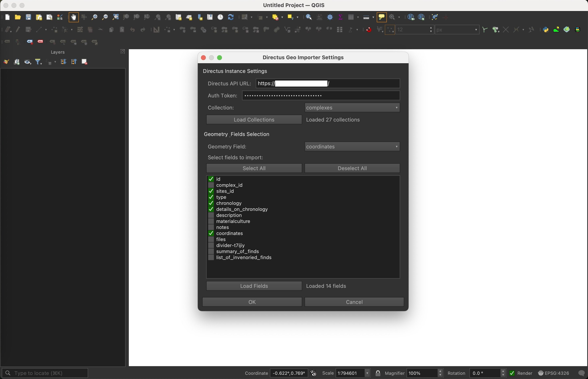

# DirectusImporter: un nuovo plugin per integrare i dati di Directus in QGIS

Siamo felici di annunciare il rilascio di **DirectusImporter**, un plugin sviluppato dal Laboratorio di Archeologia Digitale (LAD) della Sapienza per semplificare e automatizzare l’integrazione dei dati archiviati in **Directus** all’interno di **QGIS**.

Il plugin è stato progettato per supportare il lavoro quotidiano sul campo e in laboratorio, permettendo di visualizzare e interrogare direttamente in ambiente GIS le informazioni raccolte e gestite tramite il nostro backend su [Directus](https://directus.io/).

Il codice sorgente del plugin è disponibile su GitHub all’indirizzo:  
🔗 [https://github.com/lad-sapienza/DirectusImporter](https://github.com/lad-sapienza/DirectusImporter) ed è rilasciato con [licenza GNU GPL 3](https://github.com/lad-sapienza/DirectusImporter/blob/main/LICENSE).

---

## Cos’è DirectusImporter?

**DirectusImporter** è un plugin per QGIS scritto in Python che consente di:

- connettersi a una specifica istanza di Directus configurata come backend dei dati geografici;
- interrogare una collezione Directus che contiene geometrie;
- scaricare e visualizzare le feature come layer in QGIS;
- accedere ai metadati e ai campi personalizzati definiti nel CMS.

Il plugin è pensato per essere facilmente adattabile a diversi progetti e si integra perfettamente con la filosofia open source che caratterizza gli strumenti usati dal LAD.

---

## Come funziona

Una volta installato il plugin (vedi istruzioni su GitHub), è possibile:

1. **Configurare l'accesso** a una specifica istanza Directus fornendo l'URL API, la collection da interrogare e una chiave di autenticazione (token).
2. **Caricare i dati** tramite un semplice clic, ottenendo in QGIS un layer vettoriale aggiornato con i dati contenuti in Directus.
3. **Esplorare gli attributi** direttamente dal pannello degli attributi di QGIS, comprese eventuali immagini, link e valori complessi.

---

## Perché usarlo?

Nel nostro lavoro quotidiano, Directus è spesso utilizzato per gestire dati archeologici eterogenei e complessi: unità stratigrafiche, documentazione fotografica, informazioni provenienti da rilievi laser e fotogrammetrici. Portare queste informazioni dentro QGIS senza conversioni manuali o esportazioni intermedie rappresenta un vantaggio notevole in termini di efficienza, coerenza dei dati e aggiornamento in tempo reale.

Questo plugin nasce quindi come una risposta concreta a esigenze operative riscontrate nei nostri progetti sul campo, in particolare in Albania e in Grecia, e vuole essere condiviso come contributo alla comunità scientifica che adotta soluzioni open source.

---

## Screenshot

*Avvio del plugin in QGIS.*

---

*Interfaccia di configurazione del plugin DirectusImporter con i parametri di connessione all'istanza Directus.*

---

*Un layer vettoriale caricato in QGIS direttamente da una collezione di dati gestita su Directus.*

---

*Visualizzazione degli attributi provenienti da Directus, inclusi metadati e link a contenuti multimediali.*

---

*Interfaccia di filtro usando il sistema di Costruttire di interrogazioni di QGIS*

---

*La homepage del repository GitHub da cui è possibile scaricare il plugin e consultare la documentazione.*

---

## Provalo e contribuisci

Il plugin è in fase attiva di sviluppo: testarlo sul campo e raccogliere feedback è parte integrante del processo. Chiunque voglia provarlo è invitato a scaricarlo dal [repository GitHub](https://github.com/lad-sapienza/DirectusImporter) e a segnalare eventuali problemi o suggerimenti tramite l’[issue tracker](https://github.com/lad-sapienza/DirectusImporter/issues).

Per ogni dubbio o approfondimento potete contattarci direttamente tramite il [sito del LAD](https://lad.saras.uniroma1.it) o scrivere all’indirizzo: [julian.bogdani@uniroma1.it](mailto:julian.bogdani@uniroma1.it).
