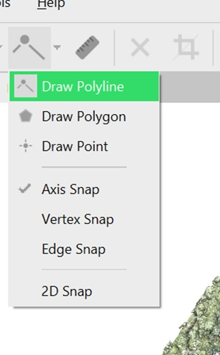
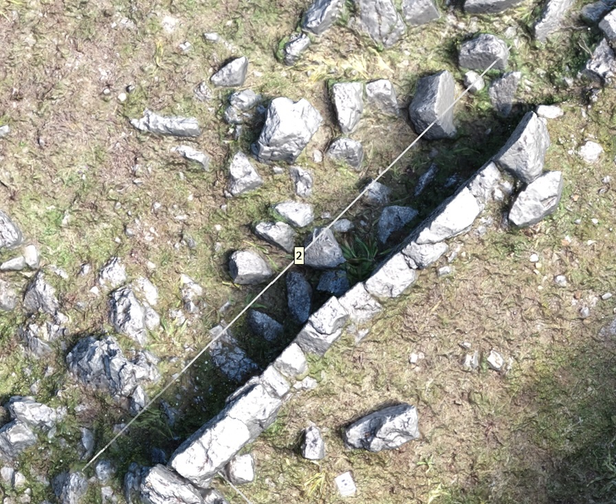
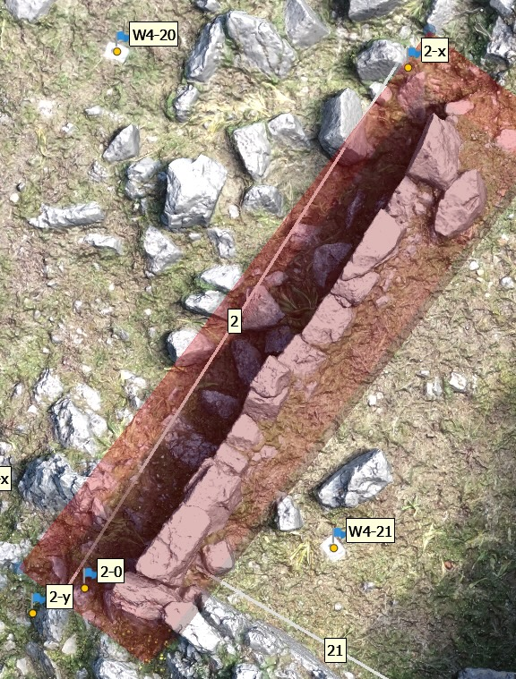

La difusione sempre più capillare di metodi di rilievo archeologico basati sulla tecnica della fotogrametria rende necessario la creazione di procedimenti che permettano di recupare dai modelli 3D “prodotti tradizionali” della documentazione archeologica. Se la creazione delle piante è gestita nativamente da software del settore, come il popolarissimo [Agisoft Metashape](https://www.agisoft.com/), quella di prospetti e sezioni richiede del lavoro in più.

## Premessa

Obiettivo del presente articolo è quello di fornire una guida pratica per l’estrapolazione di ortofoto di superfici verticali, come potrebbero essere le sezioni o i prospetti da un rilievo fotogrammetrico tridimensionale. Al termine del processo, il risultato sarà dunque un’immagine bidimensionale, metricamente corretta e non falsata da errori prospettici e possibilmente di ottima qualità, anche se la risoluzione dipenderà ovviamente dalla qualità del rilievo di partenza. Tale immagine potrà essere impiegata come elemento per pubblicazioni o come base _raseter_ per la creazione di rilievi digitali in ambiente GIS (si vd. https://lad.saras.uniroma1.it/blog/statistiche-metrologiche-automatiche-con-qgis/ su alcune delle potenzialità di tali applicazioni).

In questo tutorial ci avvarremo, a titolo d’esempio, di alcuni dati raccolti nell'ambito della Missione Archeologica a Çuka e Ajtoit (Αlbania) e, nello specifico, di un rilievo fotogrammetrico ottenuto tramite _rendering_ e sovrapposizione digitale di fotografie prese a mezzo drone. Non verranno qui dettagliati i passaggi necessari per l’ottenimento di tale rilievo. Il risultato che otterremo sarà un’ortofoto dell’alzato superstite di un muro in opera poligonale. Sebbene la metodologia impiegata possa considerarsi universalmente valida, i comandi qui riportati faranno riferimento specificatamente al software [Agisoft Metashape](https://www.agisoft.com/), uno degli strumenti più diffusi nel nostro campo per l'ottimo rapporto qualità-facilità di utilizzo-prezzo.

Agisoft Metashape permette di creare ortofotomosaici e altri prodotti, come per esempio DEM, da modelli tridimensionali in maniera estremamente facilitata, seguendo un percorso di elaborazione lineare, se si tratta di proiettare un piano che si sviluppa in orizzontale (piano XY). È comunque possibile usare un piano di proiezione diverso da quello ‘geografico’ e tra le varie possilità per noi archeologi una delle più duttili è quella che permette di definire un piano fornendo tre punti, tre triplette di coordinate. Queste equivalgono al tradizionale ‘cordino’ che usiamo sul campo per definire il piano di proiezione, di norma definito da due punti (i due chiodi), mentre la terza dimensione del piano è dato dal filo a piombo. In questo articolo si vuole definire un metodo speditivo e preciso per definire un piano di proiezione verticale dentro Metashape.

## Passo 1: ‘Tirare il cordino’

Come per il più classico rilievo diretto, la prima operazione da eseguire sarà quella di fissare il piano di riferimento orizzontale attraverso un ‘cordino’, digitalmente sostituito da un elemento lineare quotato (linestringZ). Per produrre la linea in Agisoft Metashape, sarà necessario anzitutto attivare il comando ```Draw Polyline``` dalla Toolbar (vd. immagine) o dal menù a tendina Model. 



Selezionata l’opzione, sarà quindi necessario tracciare la linea di riferimento, avendo cura di posizionare i punti di inizio e termine della geometria a una distanza adeguata dall’elemento da rilevare (la facciata) ed escludere quanto più possibile ‘intrusi’ in elevato che si possano frapporre tra quest’ultimo ed il nostro punto di vista simulato (v. immagine sotto). Terminato di disegnare la geometria, attribuiamole un nome facilmente riconoscibile e salviamo. Per il momento non dobbiamo preoccuparci della terza dimensione e dobbiamo solo assicurarci che la nostra linea (il ‘cordino’) sia il più possibile parallela alla superficie da rappresentare. È buona norma, infine, dare un nome significativo alla linea, nel caso in cui dovessimo estrarre molti prospetti dal nostro modello, es. ```prosp_1```, ```prosp_2```, ecc.




## Passo 2: Esportare e normalizzare le coordinate

Una volta realizzata la geometria, sarà possibile estrarne tutti i dati relativi — che, nel nostro caso, saranno le coordinate delle due estremità ed il nome inserito al momento dell’inserimento — in formato [GeoJSON](https://it.wikipedia.org/wiki/GeoJSON), attraverso il menu ```File``` > ```Export```  > ```Export shapes```.

Il GeoJSON è un formato di codifica di elementi vettoriali che fa uso del semplice testo, ed è quindi possibile aprire il file così creato con un programma per la lettura di documenti di testo. In ambiente Windows si raccomanda di **non** usare il programma Blocco note che viene fornito con il sistema operativo, in quanto potrebbe introdurre problemi con la codifica di alcuni caratteri, come ad esempio quello dell'interruzione di linea. Per questo motivi si raccomanda l'uso di [Notepad++](https://notepad-plus-plus.org/), [Notepad2](https://www.flos-freeware.ch/notepad2.html), e simili. Sarà dunque possibile visualizzare e modificare gli attributi della linea che abbiamo appena creato visualizzando le geometrie in forma di testo. Ovviamente, l’operazione esporterà tutti gli elementi appartenenti alla categoria ```Shapes``` presenti nel nostro lavoro, riunendole nella tipologia ```Feature collection```. Il risultato sarà dunque simile al seguente:

```json
{
  "features": [
    {
      "geometry": {
        "coordinates": [
          [
            20.119747561405298,
            39.682003256417353,
            183.32642292420428
          ],
          [
            20.119615235830111,
            39.681909476672189,
            185.07040807192504
          ]
        ],
        "type": "LineString"
      },
      "properties": {
        "LAYER": "Layer",
        "NAME": "prosp_1"
      },
      "type": "Feature"
    },
    {
      "geometry": {
        "coordinates": [
          [
            20.119487453675205,
            39.681834231537692,
            184.37274330360373
          ],
          [
            20.119425195388814,
            39.68179554340319,
            182.49861374549914
          ],
          [
            20.119425195388814,
            39.68179554340319,
            182.49861374549914
          ]
        ],
        "type": "LineString"
      },
      "properties": {
        "LAYER": "Layer",
        "NAME": "prosp_2"
      },
      "type": "Feature"
    },
  ],
  "type": "FeatureCollection"
}
```

Sarà quindi ora necessario isolare e ‘ripulire’ i dati, lasciando solo quelli della linea (o delle linee) che ci interessa estrarre. Nell’esempio sopra proposto, abbiamo inserito una linea realizzata erroneamente con 3 punti, in modo da introdurre la soluzione anche a questa eventuale fonte d’errore. 
Il primo passo sarà quello di individuare ed isolare la linea di nostro interesse attraverso il nome attribuitogli in fase di creazione (nell’esempio ‘prosp_2’), da ricercarsi in coda agli attributi dell’elemento. Potremo quindi procedere ad una ‘mondatura’ digitale dei dati, eliminando in primo luogo tutti non pertinenti alla linea di nostro interesse e successivamente i valori della nostra linea che non abbiamo interesse a mantenere. Nel caso della linea ‘prosp_2’, tra gli elementi da eliminare vi era anche il punto ‘mediano’, che non abbiamo interesse a elaborare. Il risultato a questo punto del lavoro sarà dunque questo:

``` json
[
  [
    20.119697765107098,
    39.681844866941844,
    188.21852672754807
  ],
  [
    20.119875100191919,
    39.681977508049947,
    187.15508159538413
  ]
]
```

Abbiamo così isolato i valori di `x`, `y` e `z` delle due estremità della linea (il nostro ‘cordino’). Il passaggio successivo consisterà nell’eliminazione delle parentesi, nell’isolamento dei valori dei due punti su capoversi (o righe) distinti e, infine, nella modifica della quota ad un valore standard più pratico rispetto a quello reale. Non è rilevante, ai fini del nostro lavoro, che il valore della quota sia inferiore al piano di calpestio, ma è opportuno fare attenzione che esso non superi la base dell’elemento da rilevare. A seguito di questi passaggi, il risultato dovrebbe essere similare al seguente:

```
20.119697765107098,39.681844866941844,186.5
20.119615235830107,39.681909476672189,186.5
```

> Nota: il formato sopra è noto come [CSV (comme separated values o valori separati da virgole)](https://it.wikipedia.org/wiki/Comma-separated_values) un formato estremamente semplice (ma potente) di strutturare in formato testuale dati tabellari. Ogni riga corrisponde ad un record e le virgole separano le colonne. Un file CSV può essere aperto con un qualiasi editor di testo (vale quanto detto sopra per Blocco note in ambienete Windows) ma anche con programmi per fogli di calcolo, come [LibreOffice Calc](https://it.wikipedia.org/wiki/LibreOffice_Calc) oppure [Apache OpenOffice Calc](https://it.wikipedia.org/wiki/Apache_OpenOffice_Calc). Ancora un volta si sconsiglia di aprire e modificare i file CSV con Microsoft Excel dal momento che questo programma [formatta in maniera autimatica i nostri dati in modi indesiderati, producendo anche **perdita di informazione**](https://www.moderncsv.com/why-excel-sucks-and-modern-csv-is-awesome-at-least-for-csvs/).

Abbiamo ora i riferimenti per il piano orizzontale (il nostro ‘cordino’ digitale). Per il lavoro che ci siamo preposti, tuttavia, è ancora necessario creare un terzo riferimento per l’asse verticale. Per ottenere ciò, basterà duplicare i dati di uno dei riferimenti orizzontali, aumentando il valore del parametro Z. Naturalmente, la nuova quota dovrà essere anche superiore a quella dell’elemento da rilevare, se vogliamo evitare che il risultato risulti ‘tagliato’ in fase di rendering. Infine, passiamo ad assegnare dei nominativi ad ogni singolo punto. I nominativi non sono vincolanti, ma si tenga a mente che essi rimarranno tali nel progetto Metashape e si consiglia pertanto di impiegare una codificazione semplice per una migliore gestione, che rimandi al nome della linea di partenza. Daremo dei nomi significativi per semplificarci la vita in Metashape, quindi `2-o` sta per punto di orgine del piano di proiezione del prospetto 2; `2-x` sta per punto di definizione della linea delle ascisse (x) del piano di proiezione del prospetto 2; `2-y` sta per punto di definizione della linea delle ordinate (y) del prospetto 2.  
Le coordinate `x` e `y` del punto `2-y` sono identiche a quelle del punto `2-o` (possiamo usare le funzioni copia/incolla per creare le linea), e differesce solo dalla coordinata `y` che abbiamo aumentato in maniera arbitraria, arrotondando a `190`. Non è importante definire un valore particolare, ma semplicemente dare una direzione, qumentando anche di pocchissimo la coordinata `y` del punto di orgine (`2-0`).

```
2-o,20.119697765107098,39.681844866941844,186.5
2-x,20.119615235830107,39.681909476672189,186.5
2-y,20.119697765107098,39.681844866941844,190
```

> Nel presente tutorial¸ si è proposto, a titolo d’esempio, la semplice estrapolazione dei dati di una singola linea per la produzione di un singolo elevato. Tuttavia, se, come spesso è il caso, il nostro obiettivo sarà quello di effettuare un’estrazione di una serie di elevati, allora i passaggi elencati nei paragrafi 1-3 potranno essere condotti tutti simultaneamente. Se tale fosse il nostro obiettivo, infatti, sarà sufficiente isolare tutti i punti cha abbiamo interesse ad isolare dal file GeoJSON, sempre su diverse righe, per procedere ad un unico inserimento all’interno di Metashape. Usando come base l’esempio proposto nella figura 3, il risultato prodotto risulterà il seguente:
```
1-o,20.119747561405298,39.682003256417353,182.5
1-x,20.119615235830111,39.681909476672189,182.5
1-t,20.119747561405298,39.682003256417353,188
2-o,20. 119697765107098,39.681844866941844,186.5
2-x,20. 119615235830107,39.681909476672189,186.5
2-y, 20. 119697765107098,39.681844866941844,190
3-o,20.119487453675205,39.681834231537692,182
3-x,20.119425195388814,39.68179554340319,182
3-y,20.119487453675205,39.681834231537692,186
4-o,20.119432266860173,39.681794354576304,182
4-x,20.11947527028088,39.681755063212833,182
4-y,20.119432266860173,39.681794354576304,186
```

## Passo 3: importazione del file CSV

Ora che abbiamo i tre punti sui quali agganciare gli assi di riferimento e che li abbiamo organizzati in formato CSV, il passo successivo sarà quello di importarli all’interno del nostro progetto. Per far ciò, sarà sufficiente agire tramite il comando `File` > `Import` > `Import Reference di Metashape`. Prima di eseguire l’operazione, sarà importante assicurarsi che il sistema di coordinate, il carattere delimitatore di colonne (nel nostro caso **la virgola**) e la riga di partenza selezionate siano impostati correttamente. 


Una volta tenute tali accortezze, sarà possibile eseguire l’operazione e, nella finestra che segue, ci verrà richiesto di creare nuovi `markers` i cui nomi corrisponderanno al primo valore identificato per ogni elemento (nell’esempio al paragrafo precedente, `2-o`, `2-x` e `2-y`). Approvata quest’ulteriore richiesta, i `markers` saranno disponibili nel nostro progetto. Ad operazione eseguita possiamo assicurarci che i markers siano stati inseriti nella posizione corretta attivandole la visualizzazione attraverso il comando `Model` > `Show/Hide Items` > `Show Markers`.


**ATTENZIONE**: qualora markers con la stessa denominazione di quelli in ingresso siano già presenti nel progetto, il sistema passerà alla **sovrascrittura** dei dati per quest’ultimi.



## Passo 4: Estrazione del ortofotomosaico del prospetto

Ora, non rimane che l’ultima operazione preliminare prima di procedere all’estrazione della nostra ortofoto. Per ridurre tempi di calcolo ed evitare di esportare elementi estranei a quelli che abbiamo interesse ad ottenere, dobbiamo infatti **modificare le dimensioni della regione di interesse** attraverso il comando `Move Region` dal `Toolbar`  o dalla voce di menù `Model` > `Transform Region` > `Move region`. La regione di interesse dovrà essere il più possibile ristretta intorno all’immagine da esportare, facendo attenzione che ne incorpori la totalità degli elementi. Trattandosi di un lavoro su base tridimensionale, si ricorda di assicurarsi che la regione di interesse incorpori l’elemento da rilevare non solo nei sensi della lunghezza e della larghezza, ma anche in quello dell’altezza.

Terminata anche l’ultima operazione preliminare, potremo infine procedere all’esportazione dell’ortofoto. Per far ciò, apriamo il pannello `Build orthomosaic` dalla voce di menù `Workflow`:

 

Qui, scegliamo una proiezione di tipo planare ed impostiamo come riferimento i markers inseriti al punto precedente, avendo cura di inserirli correttamente. Nell’esempio fornito ai punti precedenti, i punti `2-o` e `2-x` fungeranno da riferimento per l’asse orizzontale, mentre `2-o` e `2-y` definiranno quello verticale:


Eseguite queste operazioni, potremo procedere alla creazione del nostro ortomosaico, che verrà quindi inserito nel progetto.

**ATTENZIONE**: l’ortofoto verrà inserita nel progetto come ‘Orthomosaic’, **sovrascrivendo** ogni eventuale elemento precedente con tale nome. Nei casi in cui si intendano esportare più elementi, sarà dunque necessario procedere dapprima all’esportazione del lavoro in formato TIFF (passo successivo) e solo successivamente sarà possibile realizzare l’ortomosaico successivo, che sovrascriverà quello attualmente presente nel progetto.

Verificato il risultato finale all’interno di Metashape, possiamo infine procedere all’esportazione dell’immagine bidimensionale in formato TIFF, cliccando con il tasto destro alla voce dell’ortomosaico nel pannello `Workspace` e selezionando `Export Orthomosaic`. Una volta selezionati il nome dell’immagine e la cartella di destinazione, si aprirà il riquadro di impostazioni necessarie per l’esportazione. Si consiglia di prestare attenzione alle voci `Clip to boundary shapes` e `Write Tile Scheme` che, per gli obiettivi prefissi in questo tutorial, devono essere entrambi **de-selezionate**, come nell’immagine. Qualora l’esportazione risultasse in un file vuoto, è stato talvolta utile de-selezionare anche l’impostazione ‘Write BigTIFF file’, che consigliamo comunque di tenere attivato qualora tale problematica non si presentasse. 


Al termine dell’operazione di esportazione dell’ortomosaico, che potrebbe richiedere anche moltissimo tempo (diverse ore, se il modello tridimensionale è ad alta definizione, l'area da esportare molto grande e la macchina con la quale si esegue il calcolo non particolarmente performante), avremo infine l’elevato del nostro prospetto in formato TIFF.
 
