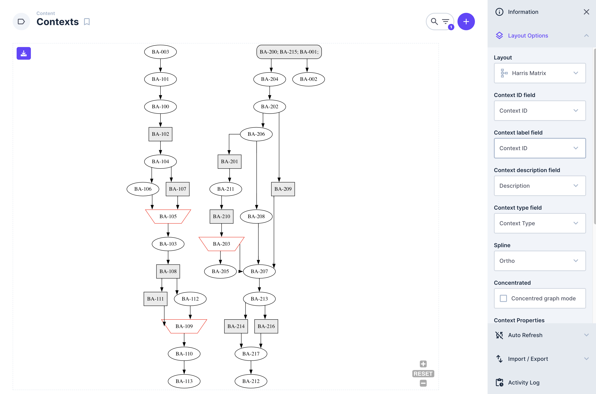

Già da più di un anno, il _team_ del LAD sta sperimentando nel cantiere archeologico di [Çuka e Ajtoit](https://lad.saras.uniroma1.it/ricerca/missione-archeologica-sapienza-a-cuka-e-ajtoit-albania/), in Albania meridionale, la piattaforma [Directus.io](https://directus.io) per la gestione del dato relazionale. La piattaforma, infatti, sta venendo utilizzata con successo per lo raccolta dei dati prodotti durante lo scavo, la ricognizione, l'analisi e dallo studio in laboratorio e in biblioteca dei contesti archeologici. Fra questi dati, viene raccolto, gestito e analizzato naturalmente, anche quello stratigrafico. La visualizzazione tabellare  — ovvero quella predefinita di Directus.io — di questa tipologia di rilievo è scomoda e poco utile e informativa. Per questo motivo si è cercato di estendere Directus.io in modo da rappresentare le stratigrafie rilevate nella forma dello *Harris Matrix*, formato certamente più utile e consueto. A tal scopo è stato sviluppato un plugin nell'àmbito di una tesi di laurea triennale, rilasciato con licenza _open source_ (GNU AGPL v.3.0) al fine di condividere con la comunità questo raggiungimento e da questa raccogliere riscontri e un contributo allo sviluppo futuro.

## Directus.io

*Directus.io* è una piattaforma intesa per rendere accessibili i database relazionali a utenti non necessariamente dotati di particolari capacità tecniche. Secondo la definizione dello stesso _team_ che lo sviluppa:

> Directus is an Open Data Platform built to democratize the database.

Il principale uso che se ne può fare su uno scavo è quello di facilitare le operazioni di *data entry* anche a quegli operatori non dotati di formazione (informatica) specifica. _Directus.io_ è uno strumento a sorgente aperta (_open source_), estremamente supportato e (sotto certe condizioni) utilizzabile gratuitamente. Potenzialmente, quindi, rappresenta una soluzione notevole ed accessibile per le fasi di raccolta del dato. Se configurato bene, le maschere intuitive della piattaforma possono facilitare l'immissione contestuale di quanto serva registrare durante gli interventi in cantiere, senza che questo rappresenti una ulteriore complicazione per chi opera.

## La stratigrafia come costrutto relazionale

Per quanto riguarda la stratigrafia è molto semplice immaginare una struttura tabellare più o meno complessa che possa accogliere i record inerenti alle caratterisctiche delle unità stratigrafiche ma anche, e soprattutto, la loro mutua relazione fisica. Il paradigma relazionale è egemone quando si tratta di immagazzinare questo tipo di dato, e _Directus.io_ consente di creare schemi assolutamente adatti a questa esigenza.

_Directus.io_, però, non è stato progettato per assolvere specificatamente al trattamento del dato stratigrafico. È, anzi, una piattaforma _general purpose_ estremamente versatile e quindi totalmente generica. Perchè una istanza di _Directus.io_ possa addattarsi alle necessità proprie di uno scavo archelogico, essa dovrà essere _estesa_.

## I _custom layout_

Quando ci si trova a gestire dati complessi, naturalmente la prima e più immediata esigenza di cui prendersi cura è quella della loro visualizzazione. Il fatto che la visualizzazione del dato stratigrafico a grafo, nella tipica froma del *Matrix di Harris*, sia da preferirsi alla arida rappresentazione tabulare delle relazioni è evidente. 

_Directus.io_ consente un'ampia gamma di Layout — overo modi di rappresentare graficamente liste di elementi — associabili al dato, e questo significa che qualunque tabella può essere presentata in uno dei formati predefiniti, a patto di configurare i layout in modo che sappiano come semantizzare il dato conenuto nei record. I _layout_ originari sono `Calendar`, `Cards`, `Kanban`, `Map` e `Table` che è il predefinito. Una volta selezionato il _layout_ di nostro interesse bisognerà semplicemente indicare alla piattaforma quale colonna del record dovrà valorizzare il particolare elemento grafico della rappresentazione scelta. Ad esempio, se scegliamo il layout *Map* e la nostra tabella possiede delle colonne relative alla localizzazione geografica del record, allora basterà indicare quale di esse debba essere considerata la fonte del dato latitudinale e quale quella del dato longitudinale del marker che rappresenterà il dato.

Poniamo il caso di una tabella che possiede due record geolocalizzati. 

La rappresentazione tabellare non è l'unica disponibile

Nelle immagini precedenti vediamo come il semplice uso della funzionalità di _layouting_ di _Directus.io_ permetta di passare da una ostica e fredda forma tabellare ad una interessantissima rappresentazione su mappa, che permette qualche forma di ulteriore personalizzazione (nella seconda immagina abbiamo usato una mappa di base, ovvero il [DARE: Digital Atlas of Roman Empire](https://dh.gu.se/dare/)). Fortunatamente questo meccanismo è estendibile e come vedremo è stato possibile produrre un layout aggiuntivo che permette di visualizzare i dati sotto forma di _Harris Matrix_. _Directus.io_ si riferisce a questo tipo di estensioni col termine _[Custom layouts](https://docs.directus.io/extensions/layouts.html)_.

## L'HMDE

L'HDME, ovvero Harris Matrix Directus Extension, è quindi un _custom layout_ per _Directus.io_  che si occupa di rappresentare il dato stratigrafico nella forma più consueta per gli archeologi odierni, ovvero il grafo orientato. Basterà, come detto, indicare alla piattaforma quali colonne sono depositarie di dati quali l'identificativo dell'Unità Stratigrafica, la sua descrizione, etc.

Bisognerà inoltre rispettare alcune specifiche nella fase di modellizzazione delle tabelle che si vogliono rappresentare. Queste specifiche vengono descritte in un [video tutorial](https://youtu.be/yEDQMQqO87I?si=cLKAWpcfR4NtguwU) accessibile di seguito, come anche dalla [pagina GitHub](https://github.com/lab-archeologia-digitale/directus-extension-harris-matrix) del progetto e che contiene anche le istruzioni dettagliate per l'installazione dell'estensione in una eventuale istanza dockerizzata di _Directus.io_.

  <iframe src="https://www.youtube.com/embed/yEDQMQqO87I?si=-mzL63fyRVUMVFVK" title="YouTube video player" frameborder="0" allow="accelerometer; autoplay; clipboard-write; encrypted-media; gyroscope; picture-in-picture; web-share" referrerpolicy="strict-origin-when-cross-origin" allowfullscreen></iframe>

Attualmente il modulo per Node.js già compilato è disponibile alla [pagina delle release](https://github.com/lab-archeologia-digitale/directus-extension-harris-matrix/releases) di HMDE, nonchè nel [*registry* gratuito di NPM.js](https://www.npmjs.com/package/directus-extension-harris-matrix). 

## _Where can we go from here_?

L'HMDE è un progetto (ancora) poco raffinato e che certamente non sfrutta tutte le potenzialità emerse durante i mesi di analisi e sviluppo. Molte migliorie potranno essere apportate in modo che l'estensione garantisca sempre miglior risposta alle richieste delle operatrici e degli operatori sullo scavo. Soprattutto, molte considerazioni teoriche che sono state appena abbozzate potranno essere approfondite ed impiegate sul percorso verso evoluzioni che magari, oggi, non riusciamo ancora a vedere.

Vorremmo concludere questo contributo accennando proprio ad un ambito che durante lo sviluppo è stato certamente trattato, ma non approfondito quanto ci sarebbe piaciuto: l'applicazione della [Teoria dei Grafi](https://www.treccani.it/enciclopedia/teoria-dei-grafi_(Enciclopedia-della-Scienza-e-della-Tecnica)/) al trattamento della rappresentazione stratigrafica. Non è questo il luogo che consenta più di un vago accenno, ma l'idea che un *Harris Matrix*, per essere tale, debba essere concepito come la _[Transitive reduction](https://www.cs.tufts.edu/comp/150FP/archive/al-aho/transitive-reduction.pdf)_ di un [grafo orientato](https://www.britannica.com/topic/graph-theory#ref909835) aciclico ci ha quasi obbligato ad invadere il campo della matematica. Una volta penetrati in quel territorio ci si è presentata una serie ampia ed affascinante di possibilità. 

Di queste possibilità, come accennato, siamo riusciti a sfiorare soltanto la superficie: speriamo di poter tornare su questi argomenti nel mnor tempo possibile.

*Stay tuned* 

---

## Risorse
**Direcus.io**
- Sito ufficiale di Directus.io  
  [https://directus.io/](https://directus.io/)
- Introduzione ai Custom layouts di Directus.io  
  [https://docs.directus.io/extensions/layouts.html](https://docs.directus.io/extensions/layouts.html)
**HMDE**
- Repository GitHub dedicata a HMDE  
  [https://github.com/lab-archeologia-digitale/directus-extension-harris-matrix](https://github.com/lab-archeologia-digitale/directus-extension-harris-matrix)
- Repository NPM.js dedicata a HMDE  
  [https://www.npmjs.com/package/directus-extension-harris-matrix](https://www.npmjs.com/package/directus-extension-harris-matrix)
- Segnalazione di un bug  
  [https://github.com/lab-archeologia-digitale/directus-extension-harris-matrix/issues](https://github.com/lab-archeologia-digitale/directus-extension-harris-matrix/issues)
- Lista dei release disponibili di HMDE:  
  [https://github.com/lab-archeologia-digitale/directus-extension-harris-matrix/releases](https://github.com/lab-archeologia-digitale/directus-extension-harris-matrix/releases)
**Teoria dei grafi**
- Voce Treccani sulla Teoria dei grafi  
  [https://www.treccani.it/enciclopedia/teoria-dei-grafi_(Enciclopedia-della-Scienza-e-della-Tecnica)/](https://www.treccani.it/enciclopedia/teoria-dei-grafi_(Enciclopedia-della-Scienza-e-della-Tecnica)/)
- Voce Britannica sulla Teoria dei grafi  
  [https://www.britannica.com/topic/graph-theory#ref909835](https://www.britannica.com/topic/graph-theory#ref909835)
- Introduzione al concetto di _Transitive reduction_  
  [https://www.cs.tufts.edu/comp/150FP/archive/al-aho/transitive-reduction.pdf](https://www.cs.tufts.edu/comp/150FP/archive/al-aho/transitive-reduction.pdf)
**DARE**
- DARE: Digital Atlas of Roman Empire:  
  [https://dh.gu.se/dare/](https://dh.gu.se/dare/)