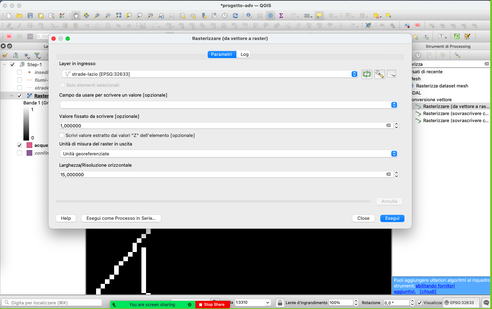

# Introduzione

Ogni anno il LAD organizza dei [laboratori GIS](../../didattica/laboratorio-gis-db) fruibili dagli studenti Sapienza e non solo. Nell'ultima edizione (a.a. 2021/2022) durante il laboratorio di GIS Avanzato abbiamo pensato di riadattare un esempio di analisi di sovrapposizione ponderata multi-criteri effettuata su dati contemporanei a un caso prettamente archeologico. L'esperimento ha trovato largo apprezzamento da parte di tutti i partecipanti e pertanto abbiamo deciso di pubblicarlo nel nostro blog con la speranza che possa essere d'aiuto e d'ispirazione a tutti coloro che si muovono nel campo delle analisi territoriali.

>L'analisi di sovrapposizione ponderata multi-criteri (o _multi criteria weighted-overlay analysis_) è un processo di classificazione di aree sulla base di una serie di attributi che queste dovrebbero possedere secondo precisi criteri scelti dall'utente. 

In questa guida sarà affrontato un caso di utilizzo di _multi criteria weighted-overlay analysis_ tramite software QGIS. Verrà preso in considerazione un caso di studio concreto, una domanda di tipo archeologico relativa ad un ambito cronologico e geografico ben preciso.

La domanda archeologica formulata è la seguente:

> Quali sono le aree dell'attuale regione del Lazio che presentano caratteristiche ottimali per lo sviluppo degli insediamenti di età romana imperiale ma che, ad oggi, non hanno dato tracce sicure in tal senso?

Per rispondere in maniera concreta, per reperire i dati necessari a questo tipo di analisi e anche per capire concretamente quali analisi dovranno essere effettuate, è necessario esplicitare meglio la richiesta.

**Guida non archeologica disponibile a:** [http://www.qgistutorials.com/it/docs/3/multi_criteria_overlay.html](http://www.qgistutorials.com/it/docs/3/multi_criteria_overlay.html)

È stato creato un repository per l'accesso a tutti i dati necessari per seguire passo passo la guida: [https://github.com/lab-archeologia-digitale/mcwoa-archeo/](https://github.com/lab-archeologia-digitale/mcwoa-archeo/)

## I dati

### Limite geografico

Il limite geografico è l'informazione più semplice da capire e anche il dato più semplice da reperire. La **Regione del Lazio** ha dei confini amministrativi ben definiti facilmente reperibili online in formato GIS, in particolare per questo esercizio i dati sono stati scaricati da: [https://www.diva-gis.org/gdata](https://www.diva-gis.org/gdata)

### Caratteristiche ottimali per l'insediamento: requisiti, dati, parametri

Questo è un elemento molto più difficile da definire e valutare e certamente molto più soggettivo.

Ai fini di questo esercizio, solo alcuni elementi verranno presi in esame, con parametri decisi _a priori_, ma che possono essere oggetto di discussione. Nello specifico, si ritengono particolarmente interessanti i seguenti elementi, che danno un'idea esuastiva del carattere attrattore / respingente di un determinato tema:

1. vicinanza alla rete viaria
1. non immediata vicinanza alla rete idrica, che da sempre è causa di rischio, ma neppure troppo distante, visto che l'acqua è una risorsa "costosa" da trasportare
1. non eccessiva vicinanza a insediamenti esistenti, che “esauriscono” il potenziale dell'area  
   
Per calcolare queste variabili abbiamo dunque bisogno di:

4. **una rete stradale di età romana imperiale**: elaborata dal [Ancient World Mapping Center](http://awmc.unc.edu/wordpress/) e liberamente disponibile in formato GIS, all'indirizzo [http://awmc.unc.edu/awmc/map_data/shapefiles/ba_roads/](http://awmc.unc.edu/awmc/map_data/shapefiles/ba_roads/)
5. **Le estensioni interne di acqua (laghi)** sono disponibili sempre a cura del [Ancient World Mapping Center](http://awmc.unc.edu/wordpress/), in formato GIS, all'indirizzo: [http://awmc.unc.edu/awmc/map_data/shapefiles/physical_data/inlandwater/](http://awmc.unc.edu/awmc/map_data/shapefiles/physical_data/inlandwater/)
6. **La rete fluviale** è stata scaricata da [https://www.diva-gis.org/gdata](https://www.diva-gis.org/gdata). Questo dato non è riferito specificatamente all'età romana, quindi al fine di rendere più corretta questa analisi sarebbe necessario un ulteriore lavoro su questo dato.
7. **La rete di insediamenti noti di età romana imperiale** è stata invece scaricata da [Pleiades](https://pleiades.stoa.org/), all'indirizzo: [http://atlantides.org/downloads/pleiades/kml/pleiades-latest.kmz](http://atlantides.org/downloads/pleiades/kml/pleiades-latest.kmz)
8. Infine, il modello digitale del terreno (DEM) con risoluzione di 30m è stato scaricato da [https://opentopography.org/](https://opentopography.org/), attraverso il plugin di `QGIS OpenTopography DEM Downloader`

Per facilitare l'accesso a questa guida, abbiamo scaricato e raccolto in un unico _repository_ tutti questi dati, che potete trovare all'indirizzo: [https://github.com/lab-archeologia-digitale/mcwoa-archeo](https://github.com/lab-archeologia-digitale/mcwoa-archeo).

## Procedura dell'analisi

### 1. Avvio del programma e preparazione dei dati
1. Aprire un nuovo progetto QGIS e caricare tutti i dati presenti nell'archivio
1. Raggruppare i livelli vettoriali (`fiumi-lazio`, `strade-lazio`, `acque-interne-lazio` e `insediamenti-imperiali`) in un gruppo chiamato `Step-1`
1. Salvare il progetto

### 2. Rasterizzazione dei dati
Questo esercizio può essere fatto sia lavrando con dati vettoriali che con dati raster, ottenendo risultati diversi. Con i dati raster, l'opzione qui prescelta, si ottiene un risultato più graduale.

Si procede quindi alla rasterizzazione dei dati vettoriali contenuti nel gruppo `Step-1` in QGIS, ovvero il processo che permette di ottenere un dato raster da un tema vettoriale.

1. Menu `Processing` > `Strumenti`
1. Nel panello che si apre cercare e aprire lo strumento `Rasterize (da vettore a raster)`
1. In `Parametri` selezionare nel menu a tendina sotto la voce `Layer in ingresso`, il valore `strade-lazio`, il primo tema da rasterizzare
1. Impostare nel campo `Valore fissato da scrivere [opzionale]` il valore `1,000000`  
   Seguendo questa impostazione, nel file raster i pixel in corrispondenza dell'estensione del vettore avranno valore `1`, gli altri `null` (v. sotto).
1. Impostare dal menu a tendina del campo `Unità di misura del raster in uscita` il valore `Unità georeferenziate`  
   Verranno usate in questo modo le unità del dato in ingresso, in questo caso metri, trattandosi di un dato in proiezione ortogonale. È necessario dunque fare molta attenzione qui, nel caso di dati espressi in cordinate geografiche, dove l'unità di base è il grado.
1. Impostare nel campo `Larghezza/risoluzione orizzontale` il valore `15,000000`  
   Questa confogurazione definisce la larghezza del pixel in uscita, ovvero 15 metri.
1. Impostare nel campo `Altezza/risoluzione verticale` il valore `15,000000`  
   Questa confogurazione definisce l'altezza del pixel in uscita, ovvero 15 metri.
1. Impostare nel campo `Estensione risultato [opzionale]` i limiti del tema `confine-lazio`, usando il botton a destra del campo.  
   Attraverso questa opzione definiamo un limite al raster in uscita. Possiamo inserire le coordinate del rettangolo manualmente, oppure (molto più semplice ed efficace) usare l'estensione massima di un determinato layer disponibile nel progetto.
1. Configurare il campo `Attribuisci un determinato valore nullo alle bande in uscita` come `non impostato` cancellando il contenuto della casella che di default è `0,000000`  
   Con questa azione stiamo definendo il valore da usare per ogni pixel che si trova in aree dove non ci sono dati. Il valore preconfigurato è `0`, mentre nel nostro caso vogliamo inserire il vallore `null`, il quale indica assenza di dati, la natura vuota, mentre `0` è pur sempre un numero.
1. In `rasterizzato` salvare il nuovo file come `strade-raster`
1. Cliccare sul bottone `Esegui` per eseguire l'algoritmo.

A questo punto, si possono ripetere le operazioni sopra decsritte, con gli stessi parametr, per tutti gli altri layer disponibili, ovvero: 
- `fiumi-lazio`, 
- `acque-interne-lazio`, e
- `insediamenti-imperiali`
L'unica eccezione riguarda la risoluzione dell'ultimo elemento, `insediamenti-imperiali`, per il quale possiamo usare una risoluzione in uscita di 30x30m (`Larghezza/risoluzione orizzontale`: `30,000000` e `Altezza/risoluzione verticale`: `30,000000`).

Infine, si può cerate un secondo gruppo di layer chiamato `Step-2` e spostarvi tutti i raster creati nei passaggi precedenti

### 2. Creare un unico tema del dato idrografico
Allo stato attuale, le informazioni relative all'idrografia si trovano su due raster diversi, ovvero `fiumi-lazio` e `acque-interne-lazio`. È utile per procedere all'analisi unire queste due informazioni in un unico file ed è possibile usare per questa funzione  uno strumento molto potente di QGIS che si chiama `Calcolatore raster`. Questo strumento, come indica il nome, funzione come una calcolatrice, operando operazioni matematiche sui dati di input che sono appunto i dati raster, che com'è noto si compongono di elementi atomici chiamati pixel, a ciascuno dei quali è associato uno p più valore numerici, descrivendo il colore o altri fenomeni, es. l'altrimetria nel caso dei DEM.

1. Cercare e aprire nel panello processing `Calcolatore raster` (sotto `GDAL` > `Raster miscellanea`)
1. Inserire l'espressione: `"acque-interne-raster@1" + "fiumi-raster@1"`
1. Utilizzare `confine-raster` come `layer di riferimento`
1. Salvare il file come `idrografia-3-valori`

L'espressione inserita, `"acque-interne-raster@1" + "fiumi-raster@1"`, indica una semplice adizione tra i valori dei singoli pixel di ogni elemento che si trovano nelle stesso spazio geografico (che si sovrappongono). Da notare che stiamo qui dando una precisa indicazione della banda da usare per ogni raster, attraverso il suffisso `@1`, anche se questi rsater in particolare hanno una sola banda. Altri tipologie di raster, più complessi possono avere 3 o più bande. È il caso delle immagii RGB, che presenano 3 bande (o canali), per cui `immagine@1` si riferirà ai valori del rosso (la banda 1), `immagine@2` ai valori della banda dei verdi e `immagine@3` ai valori del blu. Questa funzione risulta molto più interessante nei casi delle immagini multi- o iperspettrali, dove il numero di bande può essere anche molto elevato.

I pixel del raster in uscita, ovvero di `raster_idrografia`, potremmo avere quindi tre possibili valori
- `null`: quando in entrambi i raster in entrata non c'era un valore disponibilie
- `1`: quando uno solo dei due raster era valorizzato
- `2`: quando entrambi i raster presentavano un valore, ovvero quando corsi d'acqua si sovrappongono.

Quest'ultimo è una informazione ridondante e non necessaria, che possiamo eliminare sempre con il Calcolatore dei raster:

1. Aprire nuovamente il `Calcolatore raster`
1. Utilizzare la seguente espressione: `"idrografia-3-valori@1" > 0`
1. Salvare il file come `idrografia-raster`

L'espressione `"idrografia-3-valori@1" > 0` verrà valutato per ogni pixel della banda 1 del raster in ingresso (`idrografia-3-valori`) e quando il valore sarà maggiore di 0 (è il caso quindi di 1 e 2) il risultato dell'espressione sarà `1` (o `vero`) e questo valore verrà iscritto nel nuovo raster, altrimenti, il risultato sarà `0` (o `false`). L'espressione `"idrografia-3-valori@1" > 0` è quindi una espressione booleana che può avere solo due valori di output, `0` oppure `1`, estattamente com il raster in uscita.

1. Creare un gruppo di layer chiamato `Step-3` e includervi tutti i raster creati in questo passaggio

### 3. Analisi di prossimità (distanza raster)
I raster ottenuti fin'ora rappresentano attraverso pixel di valori differenti (`0`,`1`) strade, idrografia ed insediamenti della regione Lazio. Il prossimo obiettivo sarà quindi quello di creare un `raster di prossimità` (_proximity raster_) usando l'analisi di prossimità attraverso l'algoritmo `Distanza raster`. Questo procedimento creerà una mappa di prossimità raster in cui ogni pixel verrà rappresentato la distanza dal pixel più vicino nel raster sorgente. Il `raster di prossimità` potrà quindi essere utilizzato per determinaree le aree che si trovano a una certa distanza dall'input rispondendo, quindi, alla domanda formulata nell'introduzione della guida.

1. Aprire lo strumento `Prossimità (distanza raster)` (sotto `GDAL` > `Analisi raster`)
1. In `Layer di ingresso` selezionare `strade-raster`
1. Come `Unità di distanza` impostare `unità georeferenziate`
1. Impostare come `Massima distanza che deve essere generata` il valore `6000`, che equivale a 6km. Nel caso specifico **non** stiamo prendeno in considerazione distanze maggiori
1. Impostare `Valore Nodata` a `non impostato`
1. Salvare il file come `strade-prossimita`

A questo punto possiamo cambiare lo stile di visualizzazione del layer per rendere più evidente l'analisi effettuata:
1. Aprire il pannello dello `Stile dei layer`
1. In `Gradiente colore` impostare come valore massimo (max) `6000`

Completato questo passaggio, si possono ripetere le stesse operazioni anche per i layer `idrografia-raster` e `insediamenti-raster`

### 4. Riclasssificazione dei temi

#### Strade
Allo stato attuale, tutti i raster elaborati tramite l'algoritmo `Distanza raster` presentano un _continuum_ di valori da 0 a 6000. Per poter procedere all'analisi di sovrapposizione ponderata multi-criteri è opportuno riclassificare i raster per creare dei valori discreti che rappresentino rispettivamente l'idoneità relativa ai pixel in relazione alla distanza da strade, idrografia e insediamenti.

Possiamo quindi riclassificazione strade definendo tre classi, definite in maniera **arbitraria**, rispettivamente:
   - **100** che raccoglie le aree (i pixel) che si trovano fino a 1km di distanza dalle strade,
   - **50** che raccoglie le aree tra 1 e 5 km dalle strade, e
   - **10** che raccoglie le aree distanti più di 6km dalle strade.

La procedura è la seguente:
1. Aprire il `Calcolatore dei raster`
1. Inserire la seguente espressione:  
   `100*("strade-prossimita@1"<=1000) + 50*("strade-prossimita@1">1000)*("strade-prossimita@1"<=6000) + 10*("strade-prossimita@1">6000)`
1. In `Referencelayer(s)` selezionare `confine-lazio`
1. Salvare il file come `strade-riclassificato`
      
      

L'espressione `100*("strade-prossimita@1"<=1000) + 50*("strade-prossimita@1">1000)*("strade-prossimita@1"<=6000) + 10*("strade-prossimita@1">6000)` merita un po' di attenzione e necessita di qualche spiegazione per essere compresa, in quanto mischia l'aritmetica e la locica booleana. In particolare le espressioni tra parentesi (`"strade-prossimita@1"<=1000`, `"strade-prossimita@1">1000` e `"strade-prossimita@1"<=6000`) sono espressioni booleane che possono avere come output o lo `0` (in caso di falso) o l'`1`, in caso di vero. Un esempio faciliterà ultriormente la comprensione:
- se un pixel ha il valore di `4524`, allora 
   - `"strade-prossimita@1"<=1000` restituisce 0;
   - `"strade-prossimita@1">1000` restituisce 1;
   - `"strade-prossimita@1"<=6000` restituisce 1;
   - `"strade-prossimita@1">6000` restituisce 0;
   Otteniamo quindi la seguente l'espressione `100*0 + 50*1*1 + 10*0` che risulta in `0+50+0`, quindi `50`.

#### Acque
In maniera simile alle strade, possiamo or riclassificare anche le acque, definendo nuovamente tre classi, definite in maniera **arbitraria**. A differenza delle strade che sono un elemento attrattore, l'idrografia è un elemento respingente, quindi il punteggio più alto verrà dato alle distamze più remote, rispettivamente:
   - **100** che raccoglie le aree (i pixel) che si trovano oltre i 6km di distanza da un elemento idrografico,
   - **50** che raccoglie le aree tra 1km e 5 km, e
   - **10** che raccoglie le aree distanti meno di 1km.

> Un esercizio che si può fare in autonomia è quello di considerare la distanza dall'acqua come un elemento ambivalente, per cui, trovarsi troppo vicino dovrebbe costituire una penalità, esattamente come trovarsi troppo lontano, danto un punteggio più alto alla distanza intermedia.

La procedura è la seguente:
1. Aprire il `Calcolatore dei raster`
1. Inserire la seguente espressione:  
   `100*("idrografia-prossimita@1">6000) + 50*("idrografia-prossimita@1">1000) * ("idrografia-prossimita@1"<=6000) + 10*("idrografia-prossimita@1"<1000)`
1. In `Referencelayer(s)` selezionare `confine-lazio`
1. Salvare il file come `idrografia-riclassificato`

#### Insediamenti
Infine, riclassifichiamo anche gli insediamenti, definendo tre classi, rispettivamente:
    - **100** che raccoglie le aree oltre i 6km di distanza,
    - **50** che raccoglie le aree tra 1km e 5 km e
    - **10** che raccoglie le aree distanti meno di 1km.
1. Aprire il `calcolatore dei raster`
1. Inserire la seguente espressione:  
   `100*("insediamenti-prossimita@1">6000) + 50*("insediamenti-prossimita@1">1000) * ("insediamenti-prossimita@1"<=6000) + 10*("insediamenti-prossimita@1"<1000)`
1. In `Referencelayer(s)` selezionare `confine-lazio`
1. Salvare il file come `insediamenti-riclassificato`

### 5. Combinazione dei risultati
A questo punto abbiamo a disposizione tutti gli elementi per procedere con l'analisi di sovrapposizione multi-criteri dove saranno sommati tutti i raster riclassificati tramite lo strumento `Calcolatore raster` al fine di ottenere un unico output che risponda alla richiesta formulata inzialmente:   
"Quali sono le aree dell'attuale regione del Lazio che presentano caratteristiche ottimali per lo sviluppo degli insediamenti di età romana imperiale ma che, ad oggi, non hanno dato tracce sicure in tal senso?"

La procedura è la seguente
1. Aprire il `calcolatore dei raster`
1. Inserire la seguente espressione:  
   `("strade-riclassificato@1" + "idrografia-riclassificato@1" + "insediamenti-riclassificato@1" ) * "confine-raster@1"`
1. In `Referencelayer(s)` selezionare `confine-lazio`
1. Salvare il file come `overlay`

L'espressione della somma necessità di una breve spiegazione. 
- L'ultima operazione a destra, la moltiplicazione per `"confine-raster@1"` fa sì che tutti i valori che si trovano fuori dal confine regionale, diventino `0` visto che vanno moltiplicati per `0`; gli altri non cambiano, dal momento che vengono moltipliati per `1`.

### 6. Assegna di una simbologia più esplicativa
I valori dei pixel del raster finela chiamato `overlay` possono variare da `0` a `300`, dove `0` è l'area considerata meno ottimale allo sviluppo di insediamenti di età romana imperiale nel Lazio mentre `300` è quella considerata più adatta. Volendo visualizzare al meglio il risultato dell'analisi si può procedere all'assegnazione di una simbologia che riporti una scala a gradiente di colori per il raster `overlay` e che, soprattutto, permetta di rappresentare al meglio le sfumature che intercorrono tra i valori `0` e `300`.

La procedura è la seguente:
1. Aprire le proprietà del layer
1. In `Tipo di visualizzazione` impostare `Banda singola falso colore`
1. Classificare

## Nota finale
Come si è visto nei passaggi **4** e **5** diverse sono le convenzioni che stiamo addottando per la classificazione dei dati. Per esempio, la decisione di dividere tutto in tre classi e i pesi, in termini di numeri, che si danno a ciascuna classe.

Arbitraria è anche la decisione di dare a tutte le classi lo stesso peso nel passaggio **5**. Una possibile articolazione, potrebbe essere quella di dare pesi diversi alla vicinanza a siti esistenti, all'idrografia e alla viabilità, quest'ultima potendo essere m,moltiplicata per un coeficienta.

Ma da qui in avanti, si tratta di procedere con l'interpretazione dei dati, con un punto di vista prettamente archeologico!

## Sitografia

- Ancient World Mapping Center, [http://awmc.unc.edu/wordpress/](http://awmc.unc.edu/wordpress/),  ultimo accesso effettuato il 25 ottobre 2022.
- DIVA-GIS: free, simple & effective, [https://www.diva-gis.org/gdata](https://www.diva-gis.org/gdata),  ultimo accesso effettuato il 25 ottobre 2022.
- OpenTopography: Higt-Resolution Topography Data and Tools, [https://www.opentopography.org/](https://www.opentopography.org/), ultimo accesso effettuato il 25 ottobre 2022.
- Pleiades, [https://pleiades.stoa.org/](https://pleiades.stoa.org/), ultimo accesso effettuato il 25 ottobre 2022.
- QGIS Tutorials and Tips, [http://www.qgistutorials.com/it/docs/3/multi_criteria_overlay.html](http://www.qgistutorials.com/it/docs/3/multi_criteria_overlay.html),  ultimo accesso effettuato il 25 ottobre 2022.

