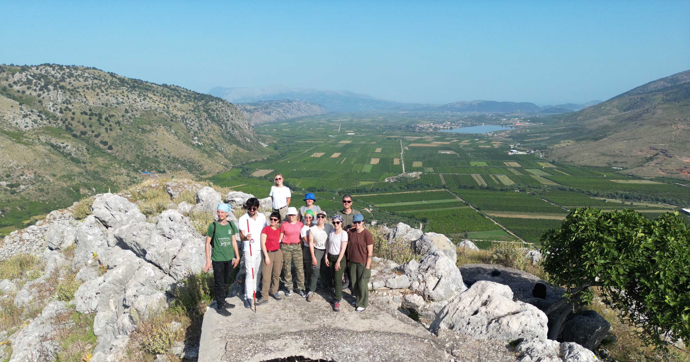

Dal 2025, la [Missione Archeologica della Sapienza in Albania](../../ricerca/missione-archeologica-sapienza-a-cuka-e-ajtoit-albania/) è finanziata nell'àmbito del progetto [Grandi Scavi Sapienza](https://www.uniroma1.it/it/node/264768).

> I grandi scavi rappresentano da quarant’anni una delle più rilevanti prospettive di ricerca della Sapienza. I grandi scavi erano costituiti inizialmente da un numero limitato di ricerche di eccezionale importanza; nel tempo sono aumentati e oggi comprendono un elevato numero di missioni scientifiche, coinvolgendo numerosi docenti, ricercatori e studenti. Gli scavi coprono un ambito geografico molto esteso (Italia, Vicino e Medio Oriente, Africa orientale e sahariana) e interessano un arco cronologico amplissimo, dal Paleolitico al Medioevo, costituendo un patrimonio eccezionale di conoscenze che pone la Sapienza in una posizione di eccellenza nel campo dell’archeologia. Ne sono una conferma i riconoscimenti internazionali e l'ottimo posizionamento dell'Ateneo nelle maggiori classifiche universitarie.  
> — https://www.uniroma1.it/it/node/264768

Al di là dell'fondamentale supporto finanziario che ci permette di continuare le ricerche sul campo, si tratta di un riconoscimento importante del lavoro svolto sul terreno in questi anni (2021-2024), da parte di un numero importante di colleghi, collaboratori, dottorandi e studenti di ogni grado (dalla triennale alla scuola di specializzazione), che con instancabile impegno, passione, dedizione e professionalità hanno portato e stanno portando avanti le ricerche. A loro va il più sincero e sentito ringraziamento della direzione della Missione.

   _Foto di gruppo della campagna 2025 a Çuka e Ajtoit_
