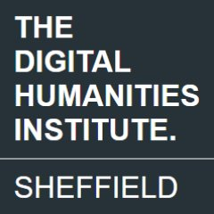

### A Hybrid Conference hosted by the University of Naples Federico II, and organised with the Sapienza University of Rome and the University of Sheffield

**13th-14th November 2023**  
Naples, University of Naples Federico II Department of Humanities
Aula ex Cataloghi Lignei

<div class="text-center border border-danger bg-warning-subtle py-3 my-5">
  <strong>Registration is required to follow the conference works online.<br />
  <a href="https://uniroma1.zoom.us/meeting/register/tZ0ucO6vpz8pH9B2AfqmBxS_Lt6Gs9EdLpEe" title="register now">REGISTER NOW!</a></strong><br />
  
</div>


## Conference programme


#### 13th November 2023

> Dipartimento di Studi Umanistici  
> Palazzo di via Marina 33  
> Aule 811-812

##### Workshops

```9:00-13:30``` Workshop 1. *The open source platform Recogito (Pelagios Commons): from semantic annotation to LOD creation* with **Valeria Vitale** (University of Sheffield) [[download abstract in PDF](./workshop-1-vitale-abstract.pdf)]

```9:00-13:30``` Workshop 2. *Re-shaping LiDAR data for Landscape Archaeology research* with **Giacomo Fontana** (UCL-KNIR) [[download abstract in PDF](./workshop-2-fontana-abstract.pdf)]

---

**13th November 2023**  
Dipartimento di Studi Umanistici  
Complesso di San Pietro Martire, via Porta di Massa 1  
Aula ex Cataloghi Lignei


```15.00```  
*Greetings*  
**Andrea Mazzucchi** (Dipartimento di Studi Umanistici, Università degli Studi di Napoli Federico II)  
**Marina Buzzoni** (AIUCD, Università Ca' Foscari Venezia)

*Introduction*  
**Rodolfo Brancato** (Università di Napoli)  
**Julian Bogdani** (Sapienza UNiversity of Rome)  
**Valeria Vitale** (University of Sheffield)

##### Panel 1. Digital Approaches in Archaeological Mapping

``15:20``  
**Margherita Azzari** (Università di Firenze), **Paolo Liverani** (Accademia dei Lincei - Università di Firenze)  
*Landscape visualisation and modelling*

```15:40```  
**Ian Haynes** (Newcastle University), **Thea Ravasi** (Newcastle University), **Iwan Peverett** (New Visions), **Stephen Kay** (The British School at Rome), **Elena Pomar** (The British School at Rome), **Elettra Santucci** (Newcastle University), **Phyllida Bailey** (Newcastle University), **Francesca Carboni** (Soprintendenza Speciale PNRR), **David Heslop** (New Visions), **Alex Turner** (Newcastle University), **Matteo Sordini** (Università di Siena), **Francesco Pericci** (Università di Siena), **Carlo Rosa** ( SIGEA Lazio), **Marc Grellert** (Technische Universität Darmstadt), **Mike Simpson** (Newcastle University) and **Simonetta Serra** (Sovrintendenza Capitolina)  
*A new approach to historical landscape visualisations. Rome Transformed SCIEDOC and the evolution of Rome’s via Statilia and Arcus Neroniani/Caelemontani in the Roman period*

```16:00```  
**Mirella Serlorenzi** (Soprintendenza di Roma), **Ascanio D'Andrea**, **Giorgia Leoni**, **Riccardo Montalbano**, **Daniele Sepio**  
*The SITAR project: new developments and future prospects*


``16:20`` - Coffee break


```17:00```  
**Nicola Lercari** (Ludwig-Maximilians-Universität München)  
*Archaeology of Archaeology at Heloros: Re-interpreting the Urban Layout of a Complex Greek Settlement in Sicily using Proximal Sensing and Data Fusion*

```17:20```  
**Giuseppina Renda** (Università della Campania ‘Luigi Vanvitelli’), **Pacifico Cofrancesco** (Università degli Studi di Pavia), **Carmine Civale**, **Sabrina Mataluna** (Università della Campania ‘Luigi Vanvitelli’)  
*The GISTArc WebGIS for the accessibility and sharing of archaeological data in Campania*

```17:40```  
**Giacomo Fontana** (UCL-KNIR)  
*Integrating lidar and machine learning for archaeological research and heritage management in mountainous and forested landscapes*

```18:00```  
**Valentina Limina** (Université catholique de Louvain)  
*Modelling (and Simulating) Ancient Landscapes. RELOAD, a new project for liminal areas in Northern Tuscany*

```18:20``` **Discussion**

```20:30``` **Social dinner**

---

#### 14th November 2023

> Dipartimento di Studi Umanistici  
> Complesso di San Pietro Martire  
> Via Porta di Massa 1  
> Aula ex Cataloghi Lignei

##### Panel 2. Digital Integration of Archaeological Legacy Data

```09:00```
**Jonathan Prag** (Oxford University)  
*Creating Links and Sharing Knowledge: an epigraphic perspective*

```09:20```  
**Anita Casarotto**, **Tesse D. Stek** (KNIR Royal Netherlands Institute in Rome – University of Groningen)  
*Mapping, comparing and integrating archaeological survey datasets on a supranational level: a pilot methodology for Italy and Portugal*

```09:40```  
**Julian Bogdani**, **Domizia D'Erasmo** (Università di Roma “La Sapienza”)  
*Old data, old methodology and new research. A case study of legacy data integration from the Kestrine region, Epirus*

```10:00```  
**Jacopo Turchetto** (Università di Padova), **Caterina Previato** (Università di Padova), **Jacopo Bonetto** (Università di Padova), **Giovanna Falezza** (Soprintendenza archeologia belle arti e paesaggio per le province di Verona, Rovigo e Vicenza)  
*​​Mapping the archaeological landscapes of San Basilio (Ariano nel Polesine, Rovigo - Italy)*

``10:20`` **Coffee break**

``10:40``  
**Barbara Borg** (Scuola Normale Superiore di Pisa)  
*Mapping the social history of Rome: a new approach to re-contextualising the inscriptions from CIL VI*

```11:00```  
**Valeria Vitale** (University of Sheffield)  
*Labels and symbols: semiotic approaches to digital map annotation using "Recogito". The case study of the representation of Antiquities on Ordnance Survey maps in Great Britain*

```11:20```  
**Philipp Köhner** (Katholische Universität Eichstätt-Ingolstadt)  
*The DFG Project Online: a digital Commentary on the Tabula Peutingeriana*

``11:40``  
**Valentina Mignosa** (Università degli Studi di Udine)  
*Digital Tools for Ancient History? Opportunities and Challenges of Deep Mapping*

```12.00``` **Discussion**

```13.00``` **Light lunch**

```15:00```  
**Nicola Laneri**, **Chiara Pappalardo**, **Daniele Santamaria**, **Marianna Nicolosi Asmundo** (Università degli Studi di Catania)  
*Introducing Godscapes: Towards a Model of Material Religion in the Second Millennium BCE Levant via Semantic Web Ontologies*

```15:20```  
**Sergio Giuseppe Russo** (University of Cambridge)  
*Legacy Pottery Data, GIS, and Statistical Computing: Revamping Archaeological Understanding in western Asia*

```15.40```  
**Irene Rossi** (CNR, ISPC), **Jérémie Schiettecatte** (CNRS, UMR 8167 Orient et Méditerranée, Paris)  
*The Maparabia project: integrating archaeological, geographic and epigraphic data for synthesizing ancient Arabia*

```16:00```  
**Andrea D’Andrea** (Università L’Orientale)  
*Legacy data or just archaeological data?*

```16.20``` **Coffee break**

```16:40```  
**Rodolfo Brancato** (Università di Napoli), **Veronica Ferrari** (Università del Salento), **Irene Rossi** (CNR, ISPC)  
*The In.Res.Agri Project: investigating Resilient Roman Agricultural Landscapes in Southern Italy. An integrated and open IT approach to modelling centuriation through archaeology, remotely sensed data, palynology and ancient texts*

```17.00```  
**Giulia Marsili** (Università di Bologna)  
*Digital Piazza Armerina: from legacy data to future research*

```17:20```  
**Claudia Lamanna** (Università di Bologna)  
*Ravenna and its Late Antique and Medieval Epigraphic Landscape: Evaluation of SfM and LiDAR technology for mapping the cultural heritage*

```17:40```  
**Laura Ebanista** (Università di Roma “La Sapienza”)  
*Use and processing of multispectral images in proximity remote sensing*

```18.00```  
**Paola Moscati** (CNR, ISPC)  
*Concluding remarks: looking back and moving forward to the openness  and interaction of knowledge*

```18.20``` *Discussion*

---

### Organised by

<div class="container text-center">
  <div class="row g-5">
    <div class="col-4">
      <a href="https://www.studiumanistici.unina.it/dipartimento/" title="Dipartimento Studi Umanistici. Università di Napoli Federico II">
        Dipartimento Studi Umanistici. Università di Napoli Federico II
      </a>
      <hr />
      <a href="https://www.studiumanistici.unina.it/dipartimento/" title="Dipartimento Studi Umanistici. Università di Napoli Federico II">
        
      </a>
    </div>
    <div class="col-4">
      <a href="https://www.sheffield.ac.uk/dhi" title="The Digital Humanities Institue. University of Sheffield">
        The Digital Humanities Institue. University of Sheffield
      </a>
      <hr />
      <a href="https://www.sheffield.ac.uk/dhi" title="The Digital Humanities Institue. University of Sheffield">
        
      </a>
    </div>
    <div class="col-4">
      <a href="https://lad.saras.uniroma1.it/" title="LAD: Laboratorio di Archeologia Digitale alla Sapienza">
        LAD: Laboratorio di Archeologia Digitale alla Sapienza
      </a>
      <hr />
      <a href="https://lad.saras.uniroma1.it/" title="LAD: Laboratorio di Archeologia Digitale alla Sapienza">
        
      </a>
    </div>
  </div>
</div>


---

### With the patronage of


<div class="container text-center">
  <div class="row gx-5">
    <div class="col-5 col-sm-5 offset-sm-1">
      <a href="http://www.topografiaantica.it/" title="Consulta di Topografia antica">
        Consulta di Topografia antica
      </a>
    </div>
    <div class="col-5 col-sm-5">
      <a href="http://www.aiucd.it/" title="Associazione per l'Informatica Umanistica e la Cultura Digitale">
        AIUCD: Associazione per l'Informatica Umanistica e la Cultura Digitale
      </a>
      <hr />
      
    </div>
  </div>
</div>

---

[Download flyer (PDF file, 3.5 MB)](./linking-pasts-and-sharing-knowledge.pdf)

