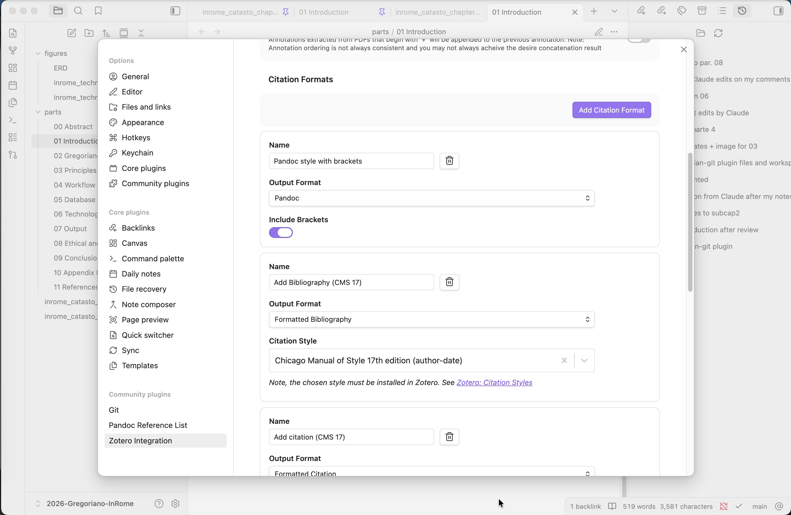
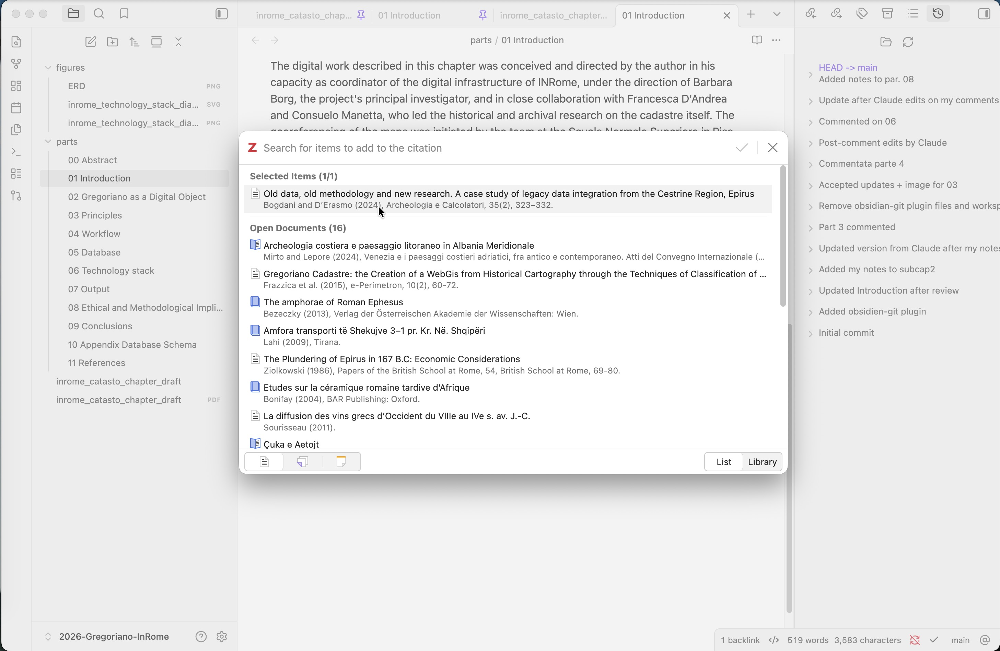
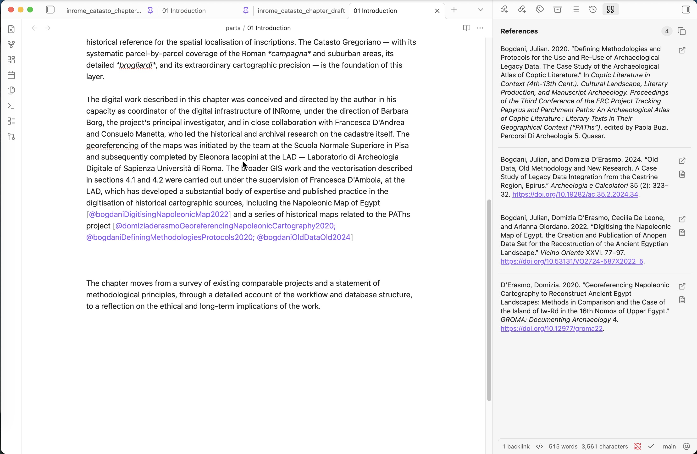
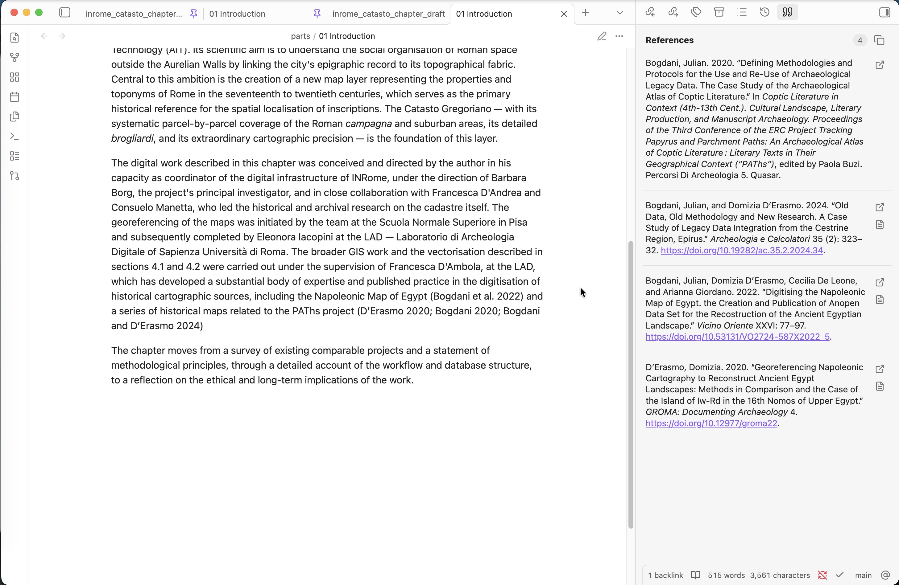

# Citare mentre si scrive: Zotero e Obsidian con Zotero Integration e Pandoc Reference List


*Questa è la soluzione che uso per gestire citazioni e bibliografia direttamente in Obsidian, senza uscire dal flusso di scrittura.*

---

## Perché non usare Word e basta?

È la domanda legittima di chiunque abbia già un workflow funzionante: Word + Zotero funziona bene, è collaudato, e i colleghi sanno come aprire un `.docx`. Perché complicarsi la vita?

La risposta breve è: **separare il contenuto dalla formattazione**. Quando si scrive in Word, la formattazione visiva è sempre presente e interferisce con il pensiero — si aggiusta il rientro, si sistema il titolo, si litiga con il numero di pagina. Scrivere in Markdown significa scrivere testo, e solo testo: la struttura è dichiarata con pochi simboli (`#` per i titoli, `**` per il grassetto), la formattazione finale è un problema che si affronta dopo e una sola volta.

Il vantaggio pratico è la **portabilità**: un file `.md` è testo semplice, leggibile da qualsiasi editor, versionabile con Git, convertibile in qualsiasi formato tramite Pandoc. Non dipende da nessun software proprietario, non si corrompe, non ha problemi di compatibilità tra versioni.

Questo post fa parte di un ragionamento più ampio sull’uso del Markdown come strumento unico per la scrittura accademica — dalla presa di note alla produzione di articoli, fino alle presentazioni (su questo torneremo con un articolo dedicato a [Marp](https://marp.app/), che sto usando progressivamente in sostituzione di PowerPoint nella didattica). Per ora ci concentriamo su un pezzo specifico del puzzle: le citazioni bibliografiche.

---

## Un po’ di contesto

[Zotero](https://www.zotero.org/) è un gestore bibliografico open source, ormai standard de facto nella ricerca accademica: permette di raccogliere riferimenti, allegare PDF, annotarli e produrre bibliografie in qualsiasi stile citazionale. Ne parleremo in dettaglio in un prossimo articolo dedicato.

[Obsidian](https://obsidian.md/) è un editor di note in Markdown che negli ultimi anni si è affermato come strumento di scrittura e gestione della conoscenza, in particolare in ambito accademico. Anche questo merita un articolo a parte: per ora basta sapere che è uno strumento testuale, estensibile tramite plugin, e che salva tutto in file `.md` leggibili da qualsiasi editor.

[Pandoc](https://pandoc.org/) è un convertitore universale di documenti, capace di trasformare file Markdown in Word, PDF, HTML e molti altri formati — gestendo anche citazioni bibliografiche tramite la propria sintassi `[@citekey]`. È lo strumento che sta sotto a buona parte dei workflow di scrittura accademica in testo semplice; anche su questo torneremo in un articolo dedicato.

Qui mi interessa un caso d’uso specifico: **scrivere un testo accademico in Obsidian e inserire citazioni collegate a Zotero**, con produzione automatica della lista bibliografica — senza esportare file intermedi, senza uscire dall’editor.

---

## I plugin necessari

Servono due plugin per Obsidian (entrambi installabili da *Settings → Community Plugins → Browse*) e nessun plugin aggiuntivo per Zotero:

- **Zotero Integration** (di mgmeyers) — gestisce l’inserimento delle citazioni
- **Pandoc Reference List** — genera la lista bibliografica in tempo reale

Entrambi comunicano direttamente con il **server locale** che Zotero espone mentre è in esecuzione (porta 23119), lo stesso meccanismo usato dall’integrazione con Word e LibreOffice. **Non è necessario esportare nessun file `.bib`.**

L’unico prerequisito è che **Zotero sia aperto** in background mentre si scrive.

---

## Configurare Zotero Integration

Una volta installato il plugin, bisogna creare almeno un *Citation Format*. Questo definisce come verrà inserita la citazione nel testo.

Per il workflow descritto qui, il formato da creare si chiama (per convenzione) **Pandoc with Brackets** e ha queste impostazioni:

- **Output Format**: `Pandoc`
- **Include Brackets**: attivo ✓

Questo produrrà citazioni nel formato `[@CitationKey]`, che è la sintassi pandoc standard per le citazioni bibliografiche.

  
*Configurazione del Citation Format in Zotero Integration.*


---

## Inserire una citazione nel testo

Con Zotero aperto in background, il flusso è il seguente:

1. Posizionare il cursore nel punto del testo dove si vuole inserire la citazione
2. Aprire la palette dei comandi con `Cmd+P` (macOS) o `Ctrl+P` (Windows/Linux)
3. Cercare e selezionare **Zotero Integration: Pandoc with Brackets**
4. Si apre il picker di Zotero: cercare il riferimento per autore, titolo o anno
5. Selezionare il riferimento — la citazione viene inserita nel testo come `[@CitationKey]`


È possibile (e consigliato) **assegnare uno shortcut** al comando per evitare ogni volta il passaggio dalla palette. In *Settings → Hotkeys*, cercare "Pandoc with Brackets" e assegnare una combinazione libera, ad esempio `Ctrl+Shift+Z`.

  
*Il picker di Zotero aperto da Obsidian tramite Zotero Integration.*


---

## Pandoc Reference List: la citazione diventa leggibile

Il secondo plugin, **Pandoc Reference List**, fa due cose distinte ma complementari:

### 1. Sostituzione visiva inline

In modalità lettura (o anche in editing, secondo la configurazione), il codice `[@CitationKey]` viene sostituito con la **abbreviazione bibliografica formattata**, ad esempio *(Rossi 2020)* o *(Rossi, 2020, p. 45)* secondo lo stile CSL scelto. Il codice sottostante rimane `[@CitationKey]` — è solo una visualizzazione.

### 2. Lista bibliografica nel pannello laterale

Nel pannello di destra di Obsidian appare automaticamente la **lista completa dei riferimenti citati nel documento aperto**, formattata nello stile bibliografico scelto e aggiornata in tempo reale mentre si scrive.

Questa lista è **copiabile** e può essere incollata in fondo al documento o in qualsiasi altro testo.

  
*Pandoc Reference List in azione: citazioni visualizzate inline e lista bibliografica nel pannello laterale.*


---

## Lo stile bibliografico

Pandoc Reference List usa i file **CSL** (Citation Style Language) — gli stessi usati da Zotero. Nelle impostazioni del plugin si può specificare il percorso a un file `.csl` a scelta. Gli stili si scaricano dal [repository ufficiale CSL](https://github.com/citation-style-language/styles) o direttamente dall’interfaccia di Zotero.

  
*La stessa schermata di prima, ma le citazioni sono visualizzate formattate da Pandoc Reference List.*

---

## Schema riassuntivo

```
Zotero (in esecuzione) 
    │
    └─ server locale (porta 23119)
            │
            ├─ Zotero Integration  →  inserisce [@CitationKey] nel testo
            │
            └─ Pandoc Reference List  →  visualizza abbreviazioni inline
                                          + lista bibliografica nel pannello
```

---

## Limiti e avvertenze

- Zotero deve essere **aperto** mentre si scrive. Se è chiuso, né il picker né la reference list funzionano.
- Il workflow produce citazioni in **testo fisso**: se si esporta in `.docx`, le citazioni non sono campi Zotero live (come invece accade scrivendo direttamente in Word). Per chi ha bisogno di consegnare un `.docx` con bibliografia dinamica, il problema esiste e merita una soluzione separata (Pandoc da CLI con `--citeproc`).
- Questo stack copre bene la fase di **scrittura e revisione in Obsidian**; per la pubblicazione finale il formato di output va valutato caso per caso.

---

## Riferimenti e risorse

- [Zotero Integration — GitHub](https://github.com/mgmeyers/obsidian-zotero-integration)
- [Pandoc Reference List — GitHub](https://github.com/mgmeyers/obsidian-pandoc-reference-list)
- [CSL Style Repository](https://github.com/citation-style-language/styles)
- [Zotero](https://www.zotero.org/)
- [Obsidian](https://obsidian.md/)