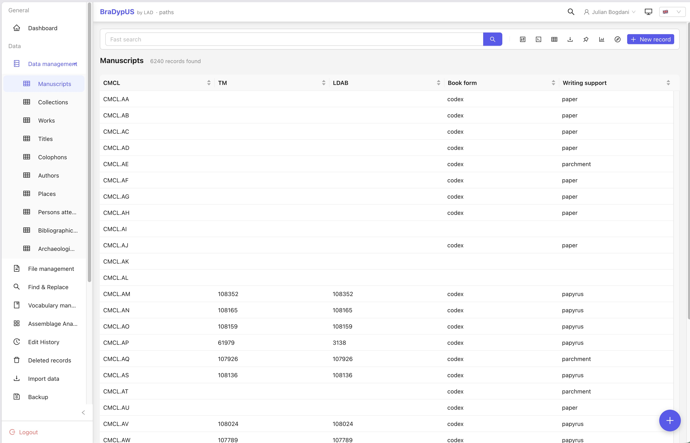
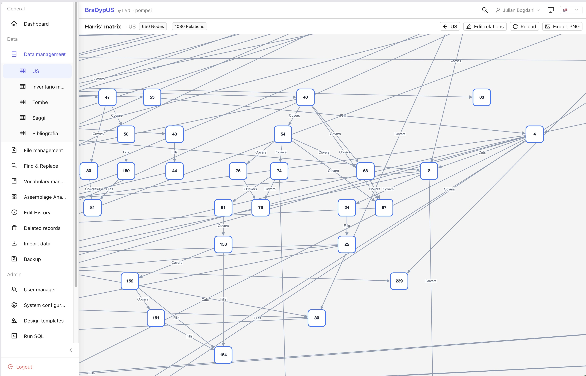
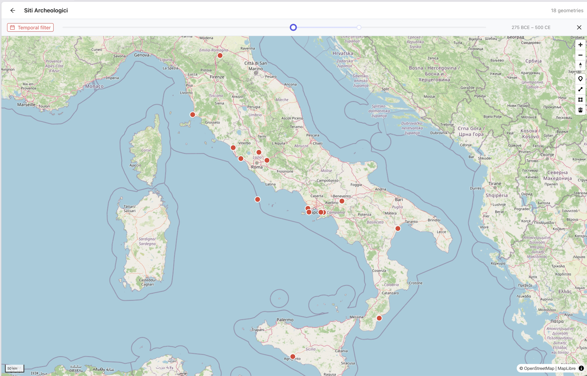

# BraDypUS 5: una nuova interfaccia, un'API aperta e i primi plugin per l'archeologia

Nel marzo del 2021 [annunciavamo la versione 4 di BraDypUS](https://lad-sapienza.it/it/notizie/2021-03-28-bdus-v4-0-0-released/): una riscrittura profonda, che rifaceva da capo l'impianto del programma — separando con chiarezza la logica applicativa dalla gestione dei dati — e rinnovava l'interfaccia ereditata dalle versioni precedenti. Era però prima di tutto un lavoro di fondamenta, e apriva esplicitamente la strada a una successiva riscrittura completa dell'interfaccia utente. Quella riscrittura è la versione 5: se la 4 aveva ricostruito le fondamenta, la 5 ricostruisce tutto ciò che ci si vede sopra, mentre il motore che custodisce i dati resta quello, collaudato, di sempre.

BraDypUS è il sistema di database on-line per la ricerca archeologica e sui beni culturali sviluppato al [LAD – Laboratorio di Archeologia Digitale della Sapienza](https://lad.saras.uniroma1.it). È software libero (licenza [GNU AGPL-3.0](https://www.gnu.org/licenses/agpl-3.0.html)), nato nel 2007 e usato da anni per gestire scavi, ricognizioni, cataloghi e archivi di progetti di ricerca. La versione 5 è disponibile da giugno 2026 e da allora è cresciuta con decine di rilasci: è già in produzione con applicazioni reali, e lo sviluppo procede a ritmo serrato — soprattutto sulle funzioni più specialistiche.

  
*La nuova DataView con la lista dei record, la barra di ricerca e le colonne configurabili.*

## Un'interfaccia completamente nuova

La differenza salta all'occhio al primo accesso. L'interfaccia non è più un insieme di pagine che si ricaricano a ogni click, ma un'applicazione a pagina singola, fluida e reattiva, che si comporta come un programma desktop pur restando dentro al browser. Si può passare in qualsiasi momento dall'italiano all'inglese, scegliere il tema chiaro o scuro, assegnare a ciascuna applicazione un colore identificativo per riconoscerla al volo quando se ne tengono aperte diverse, e lavorare comodamente anche da tablet o telefono.

Sotto questa veste ci sono strumenti di lavoro ripensati:

- **Ricerca a più livelli.** Una ricerca rapida per il quotidiano, una ricerca avanzata visuale per interrogazioni strutturate e una modalità "esperto" per chi vuole scrivere le condizioni a mano. Il filtro attivo viene salvato nell'indirizzo della pagina: il tasto "indietro" del browser riporta esattamente alla ricerca di partenza, e un link condiviso apre la stessa lista a un collega.
- **Scheda del record unificata.** Consultazione e modifica nello stesso posto, con una colonna laterale sempre visibile per link, geodati, bibliografia, cronologia e relazioni stratigrafiche. Un avviso interviene solo se si sta abbandonando la pagina con modifiche non salvate davvero fatte.
- **Storico delle versioni.** Ogni modifica a ogni record viene registrata automaticamente: si può sfogliare la cronologia, confrontare due versioni campo per campo e ripristinare qualunque stato precedente con un click.
- **Gestione dei file.** Caricamento per trascinamento, anteprime, parole chiave, ridimensionamento automatico delle immagini e una vista dedicata che elenca tutti i file dell'applicazione, segnalando quelli "orfani" non collegati ad alcun record.
- **Esportazioni** in CSV, XLSX e JSON generate al volo da qualsiasi ricerca, anche su grandi quantità di record.
- **Collegamenti tra record** con un'etichetta libera per descrivere la relazione (*cita*, *fa parte di*, …) e un grafo interattivo navigabile.

## Perché una riscrittura

Chi non è interessato agli aspetti implementativi può saltare questo paragrafo. La versione 4 aveva già fatto il lavoro difficile: separare i dati e le regole applicative dal modo in cui vengono mostrati. La versione 5 raccoglie quel frutto. Il *backend* in PHP — la parte che parla con il database, applica i permessi e garantisce l'integrità dei dati — è stato conservato ed esteso; sopra di esso è stata costruita un'**API REST** in formato JSON, ed è quell'API che la nuova interfaccia consuma, esattamente come farebbe un programma esterno. Il *frontend* è oggi un'applicazione [Vue 3](https://vuejs.org/) costruita con [Vite](https://vite.dev/) e con la libreria di componenti [Ant Design Vue](https://antdv.com/).

Sul piano dell'accesso, le sessioni PHP lato server lasciano il posto a *token* firmati (JWT): ogni scheda del browser porta con sé il proprio, così si possono tenere aperte più applicazioni contemporaneamente senza interferenze. Si può accedere con Google o ORCID tramite OAuth2/SSO, senza una password locale; le integrazioni esterne usano chiavi API con un livello di privilegio esplicito; gli amministratori possono concedere permessi di lettura e scrittura tabella per tabella, con un filtro che restringe la visibilità a un sottoinsieme di record. Restano supportati tre motori di database — SQLite, MySQL/MariaDB e PostgreSQL — ma il baricentro si è spostato: dove la versione 4 assumeva SQLite come riferimento, la versione 5 guarda a PostgreSQL come motore primario e come scelta consigliata per le installazioni di produzione. La suite di test — che nella versione 4 contava già oltre 200 prove unitarie — è stata riscritta ed estesa: test unitari e di integrazione, più una batteria di test *end-to-end* che ripercorre decine di fasi dell'intero ciclo di vita di un'applicazione, eseguita su tutti e tre i motori.

## Un'API pubblica, pensata per essere usata

Ogni dataset di BraDypUS 5 è interrogabile tramite un'API REST pubblica, senza bisogno di una sessione interattiva completa. Si autentica con una chiave API (per gli accessi automatici) o con lo stesso token della sessione utente; la risposta è JSON paginato, con l'elenco dei campi e i dati.

Il linguaggio di interrogazione è cambiato rispetto alla versione 4: il vecchio DSL *ShortSQL* è stato ritirato in favore di un formato di filtro in stile [Directus](https://directus.io/), più semplice da comporre e da validare — operatori di confronto e testo, gruppi logici `AND`/`OR`, ordinamento, paginazione, esportazione in più formati. Gli indirizzi sono organizzati per applicazione (`/{app}/api/…`), coerentemente con il resto del sistema, e una chiave è legata a una singola applicazione. La documentazione completa è disponibile come specifica [OpenAPI](https://www.openapis.org/) navigabile.

## La migrazione delle vecchie applicazioni: nessun intervento sui dati

L'API è, come si è detto, profondamente diversa da quella della versione 4. Questo poteva rendere l'aggiornamento un ostacolo. Per evitarlo abbiamo sviluppato un **sistema di migrazione automatico**, ed è la parte del progetto su cui abbiamo investito più cautela e più test.

Al primo accesso dopo l'aggiornamento, BraDypUS riconosce da solo un'applicazione della versione 4 e guida l'amministratore attraverso una migrazione _una tantum_, con una schermata dedicata. Le operazioni sullo schema e sui dati sono *idempotenti* (si possono rieseguire senza danni) e vengono applicate senza che nessuno debba mettere mano al database: il prefisso storico sui nomi delle tabelle viene rimosso automaticamente, le relazioni stratigrafiche vengono convertite da identificatori testuali a chiavi numeriche reali, le password vengono riportate in modo trasparente a un algoritmo moderno, la configurazione di tabelle e campi viene spostata dai file al database. **Nessun dato richiede un intervento manuale degli amministratori.** L'unica cosa che va rifatta a mano sono le poche query di ricerca salvate nel vecchio formato, che si ricostruiscono in un minuto con la nuova ricerca avanzata.

A supporto della migrazione c'è anche uno strumento di verifica che confronta l'applicazione prima e dopo l'aggiornamento (conteggi, valori campione, integrità dei collegamenti) e produce un rapporto; prima di ogni aggiornamento maggiore viene salvata un'istantanea di sicurezza, e sono disponibili script di backup e ripristino per singola applicazione. Stiamo già portando sulla nuova versione le applicazioni storiche del laboratorio — la prima è stata quella del progetto [PAThs](https://atlas.paths-erc.eu), fra le più complesse, con plugin sviluppati su misura — e ogni migrazione reale è occasione per irrobustire ulteriormente il processo. L'obiettivo, per chi ci ha affidato i propri dati in questi anni, è che l'aggiornamento sia un non-evento: si accede, si conferma, si continua a lavorare.

## I plugin per l'archeologia: attivi, giovani, aperti al vostro feedback

La direzione principale dello sviluppo attuale sono i **plugin di dominio**: moduli opzionali che si attivano tabella per tabella (da *Config → Tabelle*) e aggiungono funzioni specifiche senza appesantire chi non ne ha bisogno. La disattivazione non è distruttiva — i dati già inseriti restano nel database e riappaiono riattivando il plugin.

- **Relazioni stratigrafiche e Matrix di Harris.** Gestione delle relazioni tra unità stratigrafiche e visualizzazione come grafo orientato (Matrix di Harris) con evidenziazione dei cicli. Nella versione 5 le relazioni sono state ridisegnate per usare chiavi numeriche reali, con vera integrità referenziale.
- **Geodati e GeoFace.** Coordinate (punti, linee, poligoni) per i record e visualizzazione su mappa interattiva [MapLibre GL](https://maplibre.org/), con disegno ed editing delle geometrie, livelli WMS/WFS e GeoJSON/KML locali, esportazione in GeoJSON e un filtro temporale collegato alla cronologia.
- **Cronologia / datazioni incerte (*fuzzy date*).** Una grammatica compatta per registrare datazioni approssimative, per intervalli o a un solo estremo (*ante quem* / *post quem*) — per esempio `c4l BCE` per la fine del IV secolo a.C. — con livello di certezza e nome del periodo. Le datazioni diventano ricercabili per sovrapposizione di intervallo, e alimentano una **timeline cronologica comparata** che sovrappone sullo stesso asse i record di più tabelle, e un pannello di **distribuzione cronologica derivata** che mostra la densità temporale dei record collegati.
- **Inventario osteologico.** Per i contesti funerari: lo stato di conservazione di oltre cinquanta elementi anatomici per individuo, con più individui per sepoltura, grado di conservazione, certezza anatomica e di lateralità. I dati si compilano su uno **scheletro SVG interattivo** (zoom, pan, tooltip) oppure su una vista a tabella per chi preferisce lavorare in batch.
- **Radiocarbonio (C14).** Registrazione delle determinazioni (BP ed errore) con **calibrazione automatica** sulla curva IntCal20 (Reimer et al. 2020) eseguita lato server a ogni salvataggio; gli intervalli calibrati restano ricercabili e filtrabili come qualsiasi altro campo. È una calibrazione volutamente semplificata, non un sostituto di strumenti come OxCal per la precisione da pubblicazione.
- **Analisi assemblaggio.** Un *wizard* per costruire tabelle pivot e grafici a barre sulla composizione degli assemblaggi di materiale (distribuzione tipologica per unità stratigrafica, quantità per classe, ecc.), con attraversamento di più relazioni, analisi salvabili e condivisibili ed esportazione in CSV.
- **Zotero.** Collegamento dei record a librerie Zotero on-line, con citazioni formattate mostrate direttamente nella scheda.

Questi moduli sono **in sviluppo attivo**. Alcuni sono nati da poco, altri stanno maturando sul campo insieme a chi scava e cataloga. Le scelte di modello — quali attributi registrare, come rappresentarli, come interrogarli — non sono definitive, e il modo migliore per orientarle è il confronto con chi li usa davvero. Se lavorate su antropologia fisica, stratigrafia, cronologia, studi sui materiali o datazioni assolute, **scriveteci**: casi d'uso concreti, critiche e richieste sono esattamente ciò che ci serve in questa fase.

## Personalizzare ed estendere

Attorno al nucleo, la versione 5 aggiunge strumenti pensati per chi passa molte ore dentro al database e per chi lo adatta a un progetto specifico:

- **Palette dei comandi (Ctrl/Cmd + K).** Un unico campo da cui raggiungere qualsiasi tabella, vista o azione digitandone il nome, senza staccare le mani dalla tastiera. Le voci rispettano i permessi dell'utente.
- **Template di visualizzazione.** Un editor visuale per definire, tabella per tabella, come è disposta la scheda del record: sezioni, righe di campi, larghezze, pannelli a fisarmonica. È incluso anche un sistema di template di stampa per produrre schede formattate.
- **Widget per applicazione.** Chi sviluppa può agganciare a un campo un modulo JavaScript su misura, che viene caricato dentro la scheda e riceve il valore del campo in tempo reale. È già in uso in produzione: l'applicazione del progetto [PAThs](https://bdus.lad-sapienza.it/paths/), per esempio, disegna con un widget la struttura fisica dei fascicoli di un manoscritto.
- **Import/export DBML.** L'intera struttura di un'applicazione (tabelle, campi, vocabolari) si esporta in un file DBML annotato — apribile in strumenti di diagramma come dbdiagram.io — e nuove tabelle si possono creare descrivendole in DBML, con anteprima e validazione prima di scrivere alcunché.

## Rilascio continuo

BraDypUS 5 segue un modello di **rilascio continuo**: versioni frequenti, versionamento semantico, un [CHANGELOG pubblico](https://github.com/lad-sapienza/BraDypUS/blob/v5/CHANGELOG.md) che documenta ogni modifica. Dopo il consolidamento del nucleo, la fase attuale è di sviluppo intenso e mirato sulle funzionalità specialistiche descritte sopra. Chi vuole seguire da vicino l'evoluzione può tenere d'occhio il repository e il changelog.

## Provatela

Abbiamo predisposto un'**istanza dimostrativa pubblica**, con un dataset archeologico di esempio già caricato (siti, complessi, saggi, unità stratigrafiche, reperti, sepolture, relazioni stratigrafiche, geodati, grafici): è il modo più rapido per farsi un'idea.

- **Demo:** https://demo.bdus.lad-sapienza.it
- **Documentazione:** https://docs.bdus.lad-sapienza.it
- **Codice sorgente:** https://github.com/lad-sapienza/BraDypUS

Chi volesse un'istanza ospitata dal laboratorio per il proprio progetto, o assistenza per migrare un'applicazione dalla versione 4, può scrivere a **julian.bogdani@uniroma1.it**. Chi preferisce gestirla in autonomia trova nella documentazione le istruzioni per l'installazione con Docker (`docker compose up`) o su hosting condiviso.

  
*Matrix di Harris interattiva*

  
*Mappa dinamica con filtro temporale*

BraDypUS 5 è il risultato di mesi di lavoro, ma soprattutto è una base su cui costruire. La parte più interessante — gli strumenti pensati per il metodo archeologico — è appena cominciata, e ci piacerebbe farla crescere insieme a chi la userà.