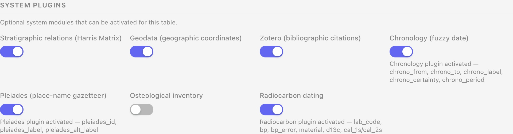
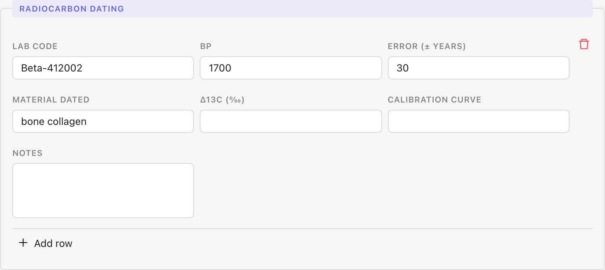
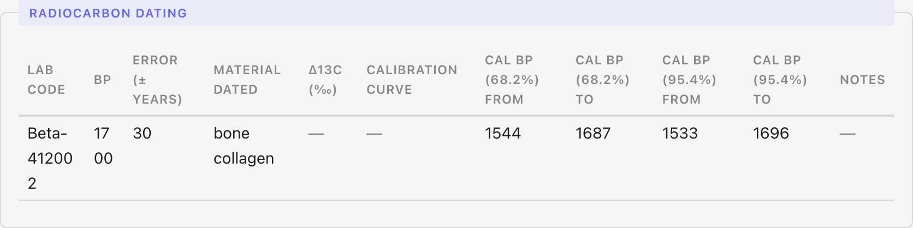

Nel precedente articolo di questa serie, [*Datare l'incerto: il sistema di cronologia di BraDypUS 5*](/it/blog/sistema-cronologia-bradypus/), abbiamo raccontato `fuzzy_date`: il plugin che registra le datazioni *interpretate* — quelle che un archeologo scrive sulla base di stratigrafia, materiali, confronti tipologici. Chiudendo quell'articolo avevamo lasciato una domanda in sospeso: e le date scientifiche, quelle che escono da un laboratorio invece che da un ragionamento? Questo articolo racconta la risposta: il plugin **`radiocarbon`**, che registra le determinazioni al radiocarbonio (C14) e le calibra automaticamente in anni di calendario.

Prima di entrare nel merito, una premessa che vale per tutto l'articolo: **`radiocarbon` è un plugin sperimentale**. È stato rilasciato con la v5.3.0, la curva di calibrazione supportata è per ora una sola (IntCal20), e diverse funzionalità restano deliberatamente fuori — le elenchiamo tutte più avanti. Lo sviluppo prosegue anche sulla base di segnalazioni e richieste di chi lo usa sul campo: la documentazione ufficiale è su [docs.bdus.lad-sapienza.it/guide/system-plugins/radiocarbon.html](https://docs.bdus.lad-sapienza.it/guide/system-plugins/radiocarbon.html), e resta il riferimento più aggiornato per lo stato del plugin.

## Cosa fa il plugin `radiocarbon`

L'attivazione è, in apparenza, identica a quella di `fuzzy_date`: **Config → Tabelle**, si sceglie la tabella, si scorre fino a *System plugins*, si accende *Radiocarbon dating*.


*Il pannello System plugins per la tabella Unità stratigrafiche: Radiocarbon dating è uno fra i plugin di sistema disponibili, qui attivato insieme a Chronology (fuzzy date) e agli altri.*

Sotto il cofano, però, il meccanismo è diverso — e vale la pena spiegarlo perché non è un dettaglio implementativo, cambia cosa si può registrare. `fuzzy_date` aggiunge **cinque colonne alla tabella stessa**: una US ha *una* cronologia interpretata, punto. Il radiocarbonio no: uno stesso contesto può avere zero, una, o più determinazioni di laboratorio (campioni diversi, materiali diversi, magari anche laboratori diversi che ridatano lo stesso campione). Attivare `radiocarbon` non tocca quindi la tabella su cui lo attivate: crea una **tabella figlia** dedicata, chiamata `{tabella}_radiocarbon` (per `us` sarà `us_radiocarbon`), con una riga per ogni determinazione, collegata al record di partenza. È la stessa architettura generica delle "tabelle plugin" già usata per misure, reperti-in-US, e simili — non un caso a parte.

I campi della tabella figlia:

| Campo | Tipo | Contenuto |
| --- | --- | --- |
| `lab_code` | testo | sigla di laboratorio, es. `Beta-412002` |
| `bp` | intero | età radiocarbonica non calibrata (anni BP) |
| `bp_error` | intero | errore di misura a 1σ |
| `material` | testo | materiale datato, es. *charcoal*, *bone collagen* |
| `d13c` | decimale | δ13C (‰), opzionale — vedi la nota in appendice |
| `curve` | testo | curva di calibrazione (oggi: solo `intcal20`) |
| `cal_1s_from` / `cal_1s_to` | intero | intervallo a 68,2% — **calcolato, non modificabile** |
| `cal_2s_from` / `cal_2s_to` | intero | intervallo a 95,4% — **calcolato, non modificabile** |
| `notes` | testo lungo | note libere |

I quattro campi calibrati non si possono scrivere a mano: qualunque valore il client invii per `cal_1s_from`, `cal_1s_to`, `cal_2s_from`, `cal_2s_to` viene scartato lato server, e ricalcolato da zero a ogni salvataggio a partire da `bp` e `bp_error`. È una scelta deliberata, diversa da come si comporta `fuzzy_date`: lì il client calcola l'etichetta e il sistema si fida; qui no, perché l'intervallo calibrato è un dato scientifico derivato che finisce nella ricerca e nei filtri, non un'etichetta cosmetica.

## Come si usa, in pratica

Nella scheda del record compare la sezione *Radiocarbon dating*, con l'editor a righe già visto per le altre tabelle-plugin: si aggiunge una riga, si compilano codice di laboratorio, BP, errore e materiale, si salva.


*Il pannello in modifica. Gli unici campi assenti sono i quattro Cal BP, di sola lettura: tutto il resto — inclusi `d13c` e `curve`, qui ancora vuoti — è modificabile.*

Dopo il salvataggio, il record mostra la riga completa, con gli intervalli calibrati calcolati dal server:


*Il pannello in lettura per US003: una determinazione su collagene osseo, BP 1700 ± 30, calibrata a 1544–1687 cal BP (68,2%) e 1533–1696 cal BP (95,4%).*

Una notazione da chiarire subito, perché genera confusione con chi non la maneggia ogni giorno: **cal BP** significa "anni calibrati prima del presente", dove il presente convenzionale è fissato per definizione al 1950. Per tradurlo in anni di calendario si sottrae da 1950: l'esempio sopra, 1544–1687 cal BP, diventa **cal 263–406 d.C.** Non è un caso che US003 sia catalogata, nella cronologia interpretata (`fuzzy_date`), come "Tardo Antico", 300–450 d.C.: le due datazioni — una scientifica, una interpretativa — si sovrappongono ma non coincidono esattamente, ed è normale che sia così: sono due fonti di evidenza indipendenti, non una copia dell'altra.

Come per `fuzzy_date`, disattivare il plugin è un'operazione di configurazione, non cancella nulla: si toglie di mezzo `radiocarbon` dai plugin visibili della tabella, ma la tabella figlia e le sue righe restano intatte, pronte a ricomparire se lo si riattiva. Per cancellare davvero i dati, oggi, l'unica via è eliminare la tabella `{tabella}_radiocarbon` da **Config → Tabelle** come una qualsiasi altra tabella — un'operazione irreversibile, segnalata chiaramente nella UI.

## Appendice tecnica: come funziona la calibrazione

Questa sezione è per chi vuole vedere l'algoritmo, non solo il risultato. Il codice è in `lib/Radiocarbon/Calibrator.php` (leggibile su [GitHub](https://github.com/lad-sapienza/BraDypUS/blob/v5/bdus-api/lib/Radiocarbon/Calibrator.php)): una classe statica, senza I/O, che prende in ingresso `bp`, `bp_error` e il nome della curva, e restituisce due coppie di interi.

La curva stessa — `lib/Radiocarbon/data/intcal20.php` — è il dataset reale IntCal20 (Reimer et al. 2020) scaricato da [intcal.org](https://intcal.org): 9.501 righe `[anno cal BP, età 14C, sigma della curva]`, dallo 0 ai 55.000 cal BP.

L'algoritmo, passo per passo:

1. **Finestra di ricerca.** Si scorre l'intera curva (non un intervallo contiguo) cercando tutti i punti la cui età 14C è plausibilmente compatibile col campione, con un margine ampio (`max(6 × errore, 300)` anni, più quattro volte la deviazione standard combinata). Scorrere l'intera curva, e non solo una porzione, è necessario perché **la curva non è monotona**: tratti lontani nel tempo possono condividere età 14C simili (i cosiddetti *plateau*), ed è proprio questo a rendere le distribuzioni calibrate potenzialmente multimodali.
2. **Interpolazione.** Dentro quella finestra, la curva viene interpolata linearmente su una griglia di un anno calendariale per punto.
3. **Densità di probabilità.** Per ogni anno della griglia, l'errore del campione e l'incertezza propria della curva in quel punto si combinano in somma quadratica; si calcola poi la densità di probabilità gaussiana dell'età BP osservata rispetto all'età 14C della curva in quell'anno.
4. **Range di confidenza.** Le densità si normalizzano, si ordinano in senso decrescente, e si accumulano punti — dal più denso al meno denso — finché la massa di probabilità cumulata non raggiunge la soglia target: 68,2% per il campo "1σ", 95,4% per "2σ".

```
margine        = max(6 × bp_error, 300)
finestra       = { anno : |età14C(anno) − bp| ≤ margine + 4 × σ_combinata(anno) }
griglia        = interpola(curva, finestra, passo = 1 anno)
per ogni anno in griglia:
    σ_combinata = √(bp_error² + σ_curva(anno)²)
    densità(anno) = gauss(bp − età14C(anno), σ_combinata)
range(soglia)  = [min, max] dei "anno" più densi la cui somma ≥ soglia
```

Il punto da tenere bene a mente è nell'ultimo passo: quello che viene restituito è il **range che contiene** tutti i punti inclusi — dal minimo al massimo — non le vere regioni ad alta densità di probabilità (*Highest Posterior Density*, HPD), che uno strumento come [OxCal](https://c14.arch.ox.ac.uk/oxcal.html) calcola e che possono essere **discontinue**. Sui tratti più piatti della curva — il caso di scuola è il plateau di Hallstatt, circa 800–400 a.C. — questa semplificazione può includere nel range finale anche una "sacca" a bassa probabilità, come se fosse parte del risultato a pieno titolo.

Un esempio reale, tratto dai dati demo di BraDypUS: una determinazione su carbone, BP 2450 ± 40 — un errore di laboratorio piuttosto contenuto — cade proprio dentro il plateau di Hallstatt. Il range a 2σ che ne risulta è **755–409 a.C.**: oltre trecento anni di ampiezza, non perché la misura sia imprecisa, ma perché la curva stessa, in quel tratto, è quasi piatta e più determinazioni con età 14C leggermente diverse ricadono nello stesso intervallo calendariale. È esattamente il comportamento che ci si aspetta da un calibratore corretto — e al tempo stesso il caso in cui la differenza fra "bounding range" e vere regioni HPD pesa di più.

**Cosa NON fa, oggi, l'algoritmo** — limitazioni dichiarate, non bug nascosti:

- **Una sola curva.** `curve` accetta solo `"intcal20"` (emisfero nord, terrestre). Niente ancora SHCal20 (emisfero sud) né Marine20 (campioni marini) — chi lavora fuori dalle medie latitudini settentrionali, o su conchiglie e altri campioni marini, deve calibrare altrove per ora.
- **δ13C registrato, non usato.** Il campo `d13c` esiste ed è pensato per la correzione da frazionamento isotopico, ma l'algoritmo di calibrazione attuale non lo legge affatto: è puro dato descrittivo, in attesa di essere effettivamente applicato.
- **Nessuna correzione da riserva marina (ΔR).** Per campioni marini servirebbe un offset che oggi non è implementato.
- **Nessuna anteprima dal vivo.** A differenza di `fuzzy_date`, che mostra l'etichetta mentre si digita, qui il calcolo avviene solo lato server al momento del salvataggio: si inseriscono BP ed errore, si salva, e si legge il range calibrato alla ricarica del record.
- **Un BP fuori curva non blocca il salvataggio.** Se la calibrazione fallisce — tipicamente un BP fuori dal range 0–55.000 cal BP coperto da IntCal20 — la riga si salva comunque, con i quattro campi calibrati lasciati vuoti e un avviso solo nel log del server, non in interfaccia.

## Il rapporto con `fuzzy_date`

I due plugin sono **indipendenti**: attivare `radiocarbon` non tocca in alcun modo `chrono_from`/`chrono_to`, e salvare una determinazione al radiocarbonio non riempie da sola la cronologia interpretata. È una scelta voluta — non tutti i record con una data C14 devono avere anche una `fuzzy_date`, e viceversa — ma niente vieta di leggere il range calibrato e trascriverlo a mano come stringa `fuzzy_date`, magari impostando la Certezza su *probable* per segnalare che si tratta di una lettura, non di un ricalcolo automatico.

È, in concreto, l'osservazione con cui si chiudeva l'articolo sul sistema di cronologia: il radiocarbonio "trasforma l'incertezza in approssimazione". Un `chrono_certainty` non basta a rendere conto di un errore di laboratorio a 1σ; un intervallo `fuzzy_date` abbastanza largo, sì — al prezzo, dichiarato anche lì, di perdere la vera forma della distribuzione di probabilità.

## Guida rapida

**1. Attiva il plugin.** *Config → Tabelle* → scegli la tabella → sezione *System plugins* → accendi *Radiocarbon dating*. Viene creata la tabella `{tabella}_radiocarbon`, nessun'altra configurazione richiesta.

**2. Nella scheda del record, aggiungi una riga** nella sezione *Radiocarbon dating*: codice di laboratorio, BP, errore, materiale datato. Il campo δ13C è opzionale.

**3. Salva.** Il server calibra automaticamente contro IntCal20 e scrive i quattro campi Cal BP — non modificabili a mano.

**4. Leggi il risultato** in cal BP (anni prima del 1950): per tradurlo in anni di calendario, sottrai da 1950.

Per aggiungere altre determinazioni sullo stesso record, si ripete il passo 2: ogni riga è indipendente, con la propria calibrazione.

## In conclusione

`radiocarbon` applica alla datazione scientifica la stessa filosofia già vista per la cronologia interpretata: **memorizzare come interi indicizzabili**, non come blob opachi, al prezzo di una semplificazione dichiarata — qui, un range che contiene il risultato invece delle vere regioni di massima probabilità, disgiunte quando la curva lo richiede. È lo stesso compromesso, sull'altro lato del problema: `fuzzy_date` rinuncia a EDTF per restare ricercabile, `radiocarbon` rinuncia alla piena precisione probabilistica di OxCal per lo stesso motivo.

Resta, come detto in apertura, un plugin **sperimentale**: una sola curva di calibrazione, nessuna correzione da riserva marina, nessuna anteprima dal vivo. Le prossime tappe — SHCal20 e Marine20 anzitutto — dipendono anche da chi lo prova sul campo e segnala cosa manca: chi ha casi d'uso reali (campioni marini, scavi nell'emisfero sud, serie di datazioni multiple sullo stesso contesto) è benvenuto ad aprire una segnalazione su [GitHub](https://github.com/lad-sapienza/BraDypUS/issues).

**Per approfondire:** [Radiocarbon dating](https://docs.bdus.lad-sapienza.it/guide/system-plugins/radiocarbon.html) · [Fuzzy date (Chronology)](https://docs.bdus.lad-sapienza.it/guide/system-plugins/fuzzy-date.html) · [Cronologia](https://docs.bdus.lad-sapienza.it/guide/usage/chrono.html) · e l'articolo che lo precede: [Datare l'incerto: il sistema di cronologia di BraDypUS 5](/it/blog/sistema-cronologia-bradypus/).
