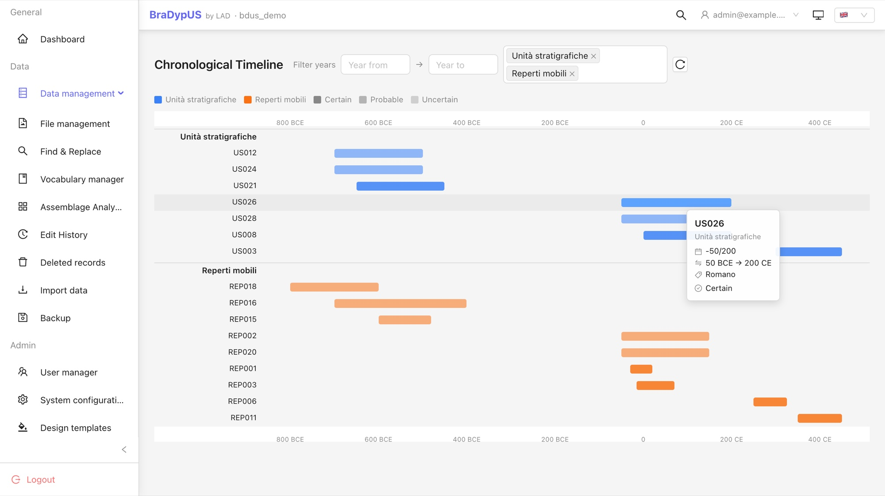
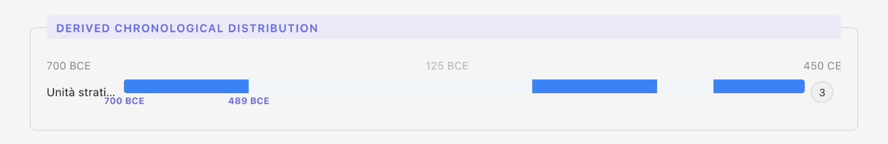
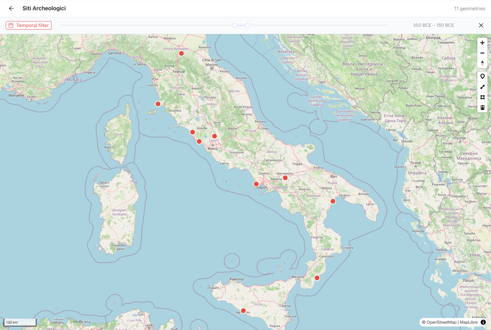

Cinque anni fa, in [*Codifica digitale della cronologia*](/it/blog/codifica-digitale-della-cronologia/), avevamo provato a mettere in fila un problema che chiunque abbia progettato una banca dati archeologica conosce bene: come si registra una datazione. Il nodo non è la data precisa — quella è facile — ma tutto ciò che le sta intorno: intervalli, approssimazione, incertezza, date alternative, termini mancanti. E, soprattutto, come si fa poi a *cercare* per cronologia.

Quell'articolo passava in rassegna tre famiglie di soluzioni. La prima: due campi, `data_da` e `data_a`, un anno di inizio e uno di fine — semplice, compatto, e soprattutto ricercabile dal database, ma incapace di esprimere in modo esplicito l'approssimazione o l'incertezza. La seconda: l'[Extended Date/Time Format](https://www.loc.gov/standards/datetime/) (EDTF), standard ISO, straordinariamente espressivo — `Y-3345~/Y-3300~`, `[Y79-08-24,Y79-10-24]` — ma che nessun database sa interrogare nativamente, scaricando tutto il lavoro sull'applicazione. La terza: i gazetteer di periodi come [PeriodO](https://perio.do/), che assegnano un URI a ogni periodo e permettono di collegare fra loro banche dati diverse, ma sono scomodissimi da usare in fase di inserimento. La conclusione era che una soluzione universale non esiste, e che la strada più sensata — almeno per una banca dati di scavo — è un **ibrido**: intervallo all'anno per la ricercabilità, uno strato di espressività sopra, ed eventualmente un ponte verso i vocabolari di periodi.

BraDypUS 5 — la versione presentata in [*BraDypUS 5: una nuova interfaccia, un'API aperta e i primi plugin per l'archeologia*](/it/blog/bradypus-v5/) — porta quell'ibrido in produzione, sotto forma di un plugin di sistema chiamato **`fuzzy_date`**, "data sfumata". Questo articolo lo spiega da zero: prima l'idea, poi la sintassi con molti esempi, poi come si integra con il resto del sistema. Chi vuole solo sapere *cosa scrivere* nella casella della cronologia può saltare direttamente alla [guida rapida](#guida-rapida) in fondo.

Gli esempi che seguono sono tratti — o adattati — dai contesti dello scavo della [Missione Archeologica della Sapienza a Çuka e Ajtoit](/it/ricerca/missione-archeologica-sapienza-a-cuka-e-ajtoit-albania/), l'antica *Kestría*, centro fortificato ellenistico dell'Epiro settentrionale, in Albania meridionale.

## Cosa fa il plugin `fuzzy_date`

Il plugin si attiva per singola tabella: **Config → Tabelle**, si sceglie la tabella, si scorre fino alla sezione *System plugins* e si accende *Chronology (fuzzy date)*. All'attivazione il sistema aggiunge alla tabella **cinque colonne**, senza altra configurazione:

| Colonna | Tipo | Contenuto |
| --- | --- | --- |
| `chrono_from` | intero | anno di inizio (negativo = a.C.); `NULL` per *ante quem* o non datato |
| `chrono_to` | intero | anno di fine (negativo = a.C.); `NULL` per *post quem* o non datato |
| `chrono_label` | testo (200) | etichetta leggibile, **generata automaticamente** dal sistema |
| `chrono_certainty` | testo | livello di certezza: `certain` / `probable` / `possible` |
| `chrono_period` | testo | nome qualitativo del periodo (es. "Ellenistico"); nessuna corrispondenza numerica |

L'impianto ricalca la **Soluzione 1** del 2021: la datazione vive in due numeri interi, `chrono_from` e `chrono_to`, che il database sa indicizzare, ordinare e confrontare. La novità è che quei due numeri non si digitano a mano. Si scrive una **stringa** in una notazione compatta — `c4l BCE`, `-350 / -300`, `? / c4q3 BCE` — e il sistema la traduce (*parsing*) in `from` e `to`, generando insieme l'etichetta. Mentre si scrive, il pannello mostra un'**anteprima in tempo reale**: l'etichetta prodotta e l'intervallo numerico, così si verifica il risultato prima di salvare.


*Il pannello «Chronology» in modifica. La stringa `c4l BCE` genera l'anteprima «Late 4th cent. BCE (−325 – −301)»; sotto, Certezza («Probable») e Periodo («Hellenistic»). Nel demo l'interfaccia — e quindi l'etichetta generata — è in inglese.*

Il **tipo di datazione non è un campo**: si deduce da quali dei due estremi sono valorizzati.

| `chrono_from` | `chrono_to` | Tipo di datazione |
| --- | --- | --- |
| `NULL` | `NULL` | non datato |
| X | X | data puntuale (anno esatto) |
| X | Y (con X < Y) | intervallo / *circa* |
| `NULL` | Y | *ante quem* (non oltre) |
| X | `NULL` | *post quem* (non prima) |

Rispetto alla Soluzione 1 nuda c'è però un'aggiunta importante: accanto all'intervallo, un asse esplicito di **certezza** (`certain` / `probable` / `possible`) e un'**etichetta di periodo** libera. Sul rapporto fra questi campi e le nozioni di *approssimazione* e *incertezza* torniamo [più avanti](#approssimazione-e-incertezza).

## La sintassi, con esempi

La stringa di cronologia ha una struttura minima:

```
input = token             → data singola o intervallo di secolo
      | token / token      → intervallo esplicito
      | ? / token          → ante quem
      | token / ?          → post quem
      | ?                  → non datato
```

Un `token` è di due tipi: **secolo** oppure **anno**.

### Token di secolo

Comincia sempre per `c`, seguito dal numero del secolo, un qualificatore opzionale e l'era (`BCE` = a.C., `CE` = d.C.):

```
c{N}{qualificatore} {BCE|CE}
```

| Qualificatore | Significato | Esempio | Intervallo |
| --- | --- | --- | --- |
| *(nessuno)* | secolo intero | `c4 BCE` | 400–301 a.C. |
| `e` | iniziale (~primo 25%) | `c4e BCE` | 400–376 a.C. |
| `m` | centrale (~50% centrale) | `c4m BCE` | 375–326 a.C. |
| `l` | finale (~ultimo 25%) | `c4l BCE` | 325–301 a.C. |
| `h1` | prima metà | `c4h1 BCE` | 400–351 a.C. |
| `h2` | seconda metà | `c4h2 BCE` | 350–301 a.C. |
| `q1` … `q4` | primo … quarto quarto di secolo | `c4q3 BCE` | 350–326 a.C. |

> **Attenzione: `4 BCE` non è il IV secolo.** `4 BCE` è l'*anno* 4 a.C.; il IV secolo a.C. si scrive `c4 BCE`. È il prefisso `c` a distinguere un token di secolo da uno di anno.

### Token di anno

| Forma | Esempio | Significato |
| --- | --- | --- |
| `-N` | `-350` | anno 350 a.C. |
| `N BCE` | `350 BCE` | anno 350 a.C. |
| `N` oppure `N CE` | `300` / `300 CE` | anno 300 d.C. |

### Intervalli e forme a un termine

| Stringa | Significato | Memorizzato come |
| --- | --- | --- |
| `c4l BCE / c3m CE` | dalla fine del IV a.C. alla metà del III d.C. | `from` = −325, `to` = 275 |
| `-350 / -300` | anni 350–300 a.C. | `from` = −350, `to` = −300 |
| `? / c4q3 BCE` | *ante quem*: non oltre il terzo quarto del IV a.C. | `from` = `NULL`, `to` = −326 |
| `c4l BCE / ?` | *post quem*: non prima della fine del IV a.C. | `from` = −325, `to` = `NULL` |
| `?` | non datato | `from` = `NULL`, `to` = `NULL` |

### La tabella di corrispondenza

Ecco, affiancate, le tre forme richieste — **stringa a secoli**, **stringa ad anni**, **datazione discorsiva** — con il risultato effettivamente memorizzato. Le righe usano contesti verosimili di Çuka e Ajtoit: un'unità stratigrafica, un tratto di fortificazione, un frammento ceramico, un livello di distruzione.

| Stringa (secoli) | Stringa (anni) | In forma discorsiva | `chrono_from` / `chrono_to` |
| --- | --- | --- | --- |
| `c4 BCE` | `-400 / -301` | IV secolo a.C. | −400 / −301 |
| `c4h1 BCE` | `-400 / -351` | prima metà del IV sec. a.C. | −400 / −351 |
| `c4l BCE` | `-325 / -301` | fine IV sec. a.C. | −325 / −301 |
| `c4q3 BCE` | `-350 / -326` | terzo quarto del IV sec. a.C. | −350 / −326 |
| `c3m BCE` | `-275 / -226` | metà del III sec. a.C. | −275 / −226 |
| `c4 BCE / c2 BCE` | `-400 / -101` | dal IV al II sec. a.C. | −400 / −101 |
| `c1e CE` | `1 / 25` | inizio I sec. d.C. | 1 / 25 |
| — | `-167` | 167 a.C. (campagna romana in Epiro) | −167 / −167 |
| — | `-350 / -300` | 350–300 a.C. circa | −350 / −300 |
| `? / c4 BCE` | `? / -301` | non oltre il IV sec. a.C. (*ante quem*) | — / −301 |
| `c2l BCE / ?` | `-125 / ?` | non prima della fine del II sec. a.C. (*post quem*) | −125 / — |
| `?` | `?` | non datato | — / — |

I confini dei quarti e delle frazioni di secolo sono **convenzionali**: il sistema li fissa una volta per tutte, così che due schedatori diversi ottengano gli stessi numeri dalla stessa indicazione. Le riserve del caso restano affidate al testo del record e al campo Certezza.

### Rilettura del "banco di prova" del 2021

L'articolo del 2021 metteva alla prova ogni soluzione su una manciata di date difficili. Rifacciamo l'esercizio con `fuzzy_date`.

- **2 settembre 31 a.C.** (battaglia di Azio). `fuzzy_date` lavora all'anno: si scrive `-31`, che produce `from` = `to` = −31. Il giorno si perde — esattamente come nella Soluzione 1 — e va, se rilevante, nel testo descrittivo del record.
- **44 a.C. – 31 a.C.** (la guerra civile che finisce ad Azio). `-44 / -31`, ovvero `from` = −44, `to` = −31.
- **Prima metà del I sec. a.C.** Nel 2021 la si codificava a mano come `data_da: -100`, `data_a: -51`. Ora è un solo token: `c1h1 BCE`, che genera lo stesso intervallo −100 / −51.
- **24 agosto 79 *oppure* 24 ottobre 79** (le due date proposte per l'eruzione del Vesuvio). `fuzzy_date` **non** rappresenta date alternative esclusive — come la Soluzione 1, e a differenza di EDTF che offre la notazione `[..., ...]`. Si ripiega su `79` (data puntuale) annotando l'alternativa nel testo.
- **ca. 3345 a.C. – ca. 3300 a.C.** (l'arco di vita della mummia del Similaun). Si scrive `-3345 / -3300` e si imposta `chrono_certainty` su `probable` (o `possible`) a farsi carico del "ca.". L'oscillazione della forbice radiocarbonica non ha un marcatore proprio: vive nell'ampiezza dell'intervallo e nella certezza. Per le determinazioni al radiocarbonio vere e proprie c'è comunque un plugin dedicato (v. [più avanti](#e-il-radiocarbonio)).
- **42000 BP (2000) – 12001 BP (2000)** (Paleolitico superiore siciliano secondo ARIADNE). Conviene, come già consigliava il 2021, convertire prima in a.C.: `-40000 / -12001`. `fuzzy_date` non esegue conversioni dalla scala *before present*.

## Approssimazione e incertezza

Il pezzo del 2021 distingueva con cura due concetti che nella pratica si confondono. L'**approssimazione** è connaturata all'oggetto: un frammento di anfora raramente ci interessa per il momento puntuale della sua produzione, quanto per l'arco della sua vita d'uso; la sua datazione è *per definizione* larga. L'**incertezza**, invece, riguarda il metodo: quanto ci fidiamo dell'attribuzione o dello strumento.

`fuzzy_date` tratta i due concetti in modo asimmetrico, e vale la pena dirlo apertamente. L'**incertezza** ha un campo dedicato, `chrono_certainty`, con tre gradini (`certain` / `probable` / `possible`). L'**approssimazione**, invece, non ha un marcatore: si esprime nell'**ampiezza dell'intervallo**. Un `c4 BCE` è "approssimato" per il solo fatto di essere largo cento anni; un `c4q3 BCE` lo è molto meno. È una semplificazione deliberata: rinunciare a un simbolo di "circa" separato è il prezzo per mantenere tutto in due colonne di interi che il database sa cercare.

## L'integrazione con il resto di BraDypUS

Il vantaggio di archiviare la cronologia come intervallo di anni è che tutto ciò che sta a valle può usarla. È qui che il plugin ripaga la rinuncia all'espressività di EDTF.

### Ricerca: l'operatore `_chrono_overlap`

È la risposta diretta al timore centrale del 2021. Applicato a `chrono_from`, l'operatore `_chrono_overlap` trova **tutti i record la cui datazione si sovrappone** a una finestra temporale data, gestendo correttamente la semantica dei `NULL` di *ante quem* e *post quem*:

```
filter[chrono_from][_chrono_overlap][]=-400&filter[chrono_from][_chrono_overlap][]=-300
```

o, come corpo JSON:

```json
{ "chrono_from": { "_chrono_overlap": [-400, -300] } }
```

La logica ha tre rami:

| Tipo di record | Incluso se |
| --- | --- |
| intervallo normale (`from` e `to` valorizzati) | l'intervallo si sovrappone a `[minimo, massimo]` |
| *ante quem* (`from` è `NULL`) | `to >= minimo` |
| *post quem* (`to` è `NULL`) | `from <= massimo` |
| non datato (entrambi `NULL`) | mai |

Così "tutti i contesti che possono cadere nel IV secolo a.C." è **una sola** interrogazione, e comprende sia il muro datato `-380 / -320`, sia il riempimento `? / -350` (*ante quem*), sia lo strato `-330 / ?` (*post quem*). È precisamente ciò che nel 2021 sembrava richiedere "un lavoro di programmazione davvero impegnativo": oggi è un operatore.

> **Attenzione.** `_chrono_overlap` va usato **solo** su `chrono_from`. Sugli altri campi valgono gli operatori standard: `filter[chrono_certainty][_eq]=probable`, `filter[chrono_period][_icontains]=ellenistico`, `filter[chrono_to][_nnull]=true` per i soli record datati, e così via.

### La Timeline cronologica comparata

È una vista a pagina intera che si apre dalla lista dei record (il pulsante *calendario* nella barra degli strumenti) e **sovrappone sullo stesso asse temporale** tutti i record con dati `fuzzy_date` delle tabelle scelte. Ogni riga è un record, raggruppato per tabella; ogni barra si estende da `chrono_from` a `chrono_to`. Ogni tabella ha il proprio colore, e l'**intensità** della barra rende la certezza: piena per `certain`, via via più tenue per `probable` e `possible`. Passando il mouse su una barra compaiono titolo, intervallo (grezzo e in forma leggibile), periodo e certezza. In cima si scelgono le tabelle da includere e si può restringere l'asse a un intervallo di anni.


*La Timeline cronologica comparata con due tabelle sovrapposte sull'asse degli anni: il colore distingue la tabella, l'opacità la certezza. Il tooltip di US026 mostra intervallo, periodo e certezza.*

### La Distribuzione cronologica derivata

È un pannello che compare nel corpo della scheda di un record **quando la tabella ha relazioni con altre tabelle a cui `fuzzy_date` è attivo**. Per ogni tabella collegata calcola la densità cronologica dei record legati a quello corrente — l'arco `chrono_from`–`chrono_to` di ciascuno viene ripartito su un asse a sessanta intervalli — e la disegna lungo la linea del tempo. L'intervallo più affollato è evidenziato con le sue etichette *from* e *to* e il numero di record; ogni tratto è un link che apre la lista dei record correlati filtrata su quel periodo.

Concretamente: aprendo la scheda di un sito, il pannello mostra come si distribuiscono nel tempo le datazioni di tutte le unità stratigrafiche (o di tutti i reperti) a esso collegate — un colpo d'occhio su "quando vive questo contesto".


*La Distribuzione cronologica derivata: le datazioni dei record collegati a un sito, distribuite lungo l'asse del tempo, con l'intervallo di picco (qui 700–489 a.C., 3 record) in evidenza.*

Il comportamento predefinito segue un solo salto automatico: le tabelle figlie dirette (relazione con chiave esterna) che hanno `fuzzy_date`. Per raggiungere un discendente più lontano — per esempio "da un Sito, i Reperti collegati attraverso le Unità stratigrafiche" — ogni tabella può avere un **percorso di distribuzione cronologica** configurato in *Config → Tabelle*: le tabelle intermedie fanno da semplice ponte (le US non devono avere una propria cronologia), e solo l'ultima della catena deve avere `fuzzy_date` attivo.

### La mappa (GeoFace)

Quando `fuzzy_date` è attivo su una tabella, la mappa GeoFace mostra una **barra di filtro temporale**: un cursore a due maniglie sugli anni (da −3000 a 2000, passo di 25 anni). Trascinando le maniglie, i punti sulla mappa vengono filtrati in tempo reale con `_chrono_overlap` — inclusi, di nuovo, i record *ante quem* e *post quem* che intersecano la finestra selezionata. In pratica si "scorre" lungo il tempo e si guarda quali siti o contesti si accendono.


*GeoFace con il filtro temporale attivo (350–150 a.C.): il cursore a due maniglie restringe in tempo reale i marker sulla mappa, usando `_chrono_overlap`.*

### La Harris Matrix su asse assoluto

È già realizzata, in una versione ancora da affinare: una disposizione a cronologia assoluta che colloca le unità stratigrafiche su una linea del tempo verticale usando la loro data `fuzzy_date`. Il diagramma stratigrafico, di norma puramente relativo, guadagna così una scala: le unità non si limitano più a stare "sopra" o "sotto", ma si collocano nel tempo secondo la datazione che è stata loro attribuita.

### E il radiocarbonio?

`fuzzy_date` serve per le datazioni *interpretate*, quelle che si digitano. Le date scientifiche al radiocarbonio hanno un plugin a parte, `radiocarbon`: si inseriscono il valore BP di laboratorio e l'errore, e il server **calibra** contro la curva IntCal20, memorizzando gli intervalli in anni di calendario (a 1σ e 2σ) — di nuovo come semplici colonne di interi. La filosofia è la stessa di `fuzzy_date`: due (anzi quattro) colonne indicizzabili, al prezzo di una semplificazione dichiarata — un unico intervallo che racchiude il risultato, non le regioni di massima densità di probabilità, eventualmente disgiunte, che restituirebbe uno strumento come OxCal. I due plugin sono indipendenti: una determinazione al radiocarbonio non riempie automaticamente `chrono_from` e `chrono_to`. Ma nulla vieta di leggere l'intervallo calibrato e trascrivere a mano la `fuzzy_date` corrispondente — che è, in concreto, l'osservazione del 2021 secondo cui il radiocarbonio "trasforma l'incertezza in approssimazione".

## Guida rapida

Per chi non vuole leggere la documentazione. Uno schema di riferimento.

**1. Accendi il plugin.** *Config → Tabelle* → scegli la tabella → sezione *System plugins* → attiva *Chronology (fuzzy date)*. Compaiono cinque colonne, nessun'altra configurazione. Si può spegnere quando si vuole: i dati restano.

**2. Nella scheda del record, scrivi nella casella "Chronology string":**

| Se hai… | Scrivi | Esempio |
| --- | --- | --- |
| un secolo | `c{N} BCE` oppure `c{N} CE` | `c4 BCE` |
| una parte di secolo | `c{N}` + `e` `m` `l` `h1` `h2` `q1`…`q4` + era | `c2l BCE`, `c1h1 BCE`, `c3q2 CE` |
| anni precisi (intervallo) | `-{da} / -{a}` | `-350 / -300` |
| un anno solo | `-{anno}` oppure `{anno} BCE` / `CE` | `-167`, `44 BCE`, `330 CE` |
| solo il limite superiore (*ante quem*) | `? / {token}` | `? / c4 BCE`, `? / -300` |
| solo il limite inferiore (*post quem*) | `{token} / ?` | `c2 BCE / ?`, `-125 / ?` |
| nessuna datazione | `?` | `?` |

**3. Imposta la Certezza** (`certo` / `probabile` / `possibile`) e, se serve, il **Periodo** (testo libero, es. "Ellenistico").

**4. Guarda l'anteprima** (etichetta + intervallo numerico), poi salva.

Quattro regole per non sbagliare:

- `c` davanti = secolo; senza `c` = anno. `c4 BCE` non è `4 BCE`.
- L'era va sempre indicata: `BCE` / `CE`, oppure il segno meno per gli anni a.C.
- Lo `/` separa i due termini di un intervallo; `?` sta per "estremo mancante" o "tutto ignoto".
- Non esiste un campo "tipo di data": puntuale, intervallo, *ante quem* e *post quem* si deducono da quali estremi lasci vuoti.

## In conclusione

Nel 2021 avevamo previsto un ibrido, e `fuzzy_date` è quell'ibrido:

- la **memoria** è la Soluzione 1 — due interi che il database sa maneggiare;
- l'**espressività** di EDTF è stata spostata al **momento dell'inserimento**, sotto forma di grammatica compilata: non c'è EDTF nel database, ma non c'è nemmeno il lavoro di ricerca su EDTF;
- l'**incertezza** ha un asse dedicato, `chrono_certainty`; l'**approssimazione** vive nell'ampiezza dell'intervallo;
- il **periodo** ha un campo, `chrono_period` — per ora una semplice etichetta qualitativa. Il collegamento a gazetteer condivisi come PeriodO resta l'anello mancante, ed è in valutazione per un'implementazione futura del plugin.

Restano fuori, per scelta: la granularità sotto l'anno, l'intero EDTF dei livelli 1 e 2, le date alternative esclusive. In compenso, quello che c'è è **ricercabile davvero** — con `_chrono_overlap`, sulla mappa, nella timeline, nella distribuzione derivata — e per una banca dati di scavo è spesso ciò che conta di più.

**Per approfondire:** [Fuzzy date (Chronology)](https://docs.bdus.lad-sapienza.it/guide/system-plugins/fuzzy-date.html) · [Cronologia](https://docs.bdus.lad-sapienza.it/guide/usage/chrono.html) · [Geodata & GeoFace](https://docs.bdus.lad-sapienza.it/guide/system-plugins/geodata.html) · [Radiocarbon dating](https://docs.bdus.lad-sapienza.it/guide/system-plugins/radiocarbon.html) · e il pezzo di partenza: [Codifica digitale della cronologia](/it/blog/codifica-digitale-della-cronologia/).
