In questo articolo spiegheremo come automatizzare la raccolta di dati statistici sulla metrologia utilizzata nei paramenti murari antichi, faccendo uso di QGIS. L'estrapolazione di dati quantitativi sulle techniche costruttive antiche al fine di compilare tabelle utili a valutazioni metrologiche e/o mensiocronologiche è un lavoro piuttosto lungo, che richiede fasi di acquisizioni laboriose sul terreno. Nell'esempio che esponiamo nei paragrafi seguenti, abbiamo ridotto al massimo la fase di acquisizione dei dati sul campo, concentrando i nostri sforzi sull'utilizzo proficuo dei strumenti digitali che possono aiutarci in questa analisi.

### Premessa e dati di partenza

Per questo articolo-tutorial useremo alcuni dati raccolti nell'ambito della [Missione Archeologica a Çuka e Ajtoit (Αlbania)](../ricerca/missione-archeologica-sapienza-a-cuka-e-ajtoit-albania/), nello specifico nel rilievo della facciata della Porta 1, realizzata in età ellenistica in opera poligonale monumentale. Il rilievo è stato realizzato mediando il procedimento fotogrammetrico, con immagini acquisite attraverso l'uso di droni. In questo articolo non verranno affrontate le fasi iniziali del rilievo, ovvero l'acquisizione delle immagini, il loro orientamento, la creazione della nuvola di punti e dell'ortofoto finale. Partiremo, invece, da un prodotto finito, ovvero il rilievo pietra-per-pietra realizzato in ambiente GIS, con un layer di linee sull'ortofoto.

Il tema in formato Geopackage può essere scaricato seguendo [questo link](./rilievo.gpkg).

## 1. Pulizia dei dati: convertire le poliline in poligoni

Il primo passaggio è quello di convertire il layer di polilinee in poligoni, per ottenere che ogni pietra/elemento sia rappresentato da un poligono. Questo pasaggio piuò essere saltato se il vostro rilievo di partenza fa già uso di poligoni.

Il primo passaggio richiede, dunque, di caricare  il nostro layer di esempio in un progetto QGIS nuovo:


Se si va a guardare la tabella degli attributi, si noterà che questo file utilizza il campo `type` codificare alcuni elementi diversi dai blocchi, nello specifico le linee di differenza di profondità dal piano.

Applicando una simbologia per categorie si può ottenere la vista seguente:


Per la nostra analisi sono necessarie soltato le linee che definiscono i blocchi, quindi possiamo applicare un filto per eliminare le altre. Possiamo usare per questo lo strumento di `Query Buider` (Costruttore di interrogazioni) di QGIS:


L'espressione `"type" IS NULL` permette di filtrare e visualizzare solo gli elementi che presentano un valore *NULL* nel campo `tipo`.
Otteniamo quindi un layer che riporta solo le geometrie che ci interessano:


A questo punto possiamo usare lo strumento **Polygonize** di QGIS che troviamo nel pannello di `Processing`, accessibile da `Menu Processing` > `Toolbox`:

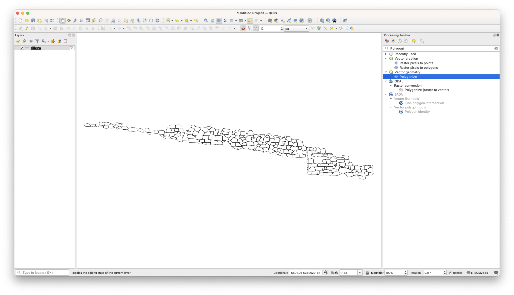

Possiamo lasciare le opzioni predefinite nella finestra dello strumento e utilizzare un layer temporaneo per il risultato della nostra analisi:


Se tutto è andato a buon fine, il layer `Polygons` dovrebbe essere aggiunto alla lista dei layer e dovremmo riuscire ad visualizzare un risultato simile all'immagine seguente:


Se guardiamo il risultato con attenzione, possiamo notare come QGIS ha creato anche alcuni poligoni che non ci servono, come gli interstizi tra i blocchi evidenziati in giallo nella figura seguente:


Li possiamo certamente eleminare manualmente, ma sarebbe un'operazione lunga, quindi proviamo a selezionare in automatico tutti i poligoni che hanno una superficie troppo piccola per essere dei blocchi. Per fare questo abbiamo bisogno di aggiungere un attributo che contenga la superficie di ciascun poligono e lo possiamo fare facilmente con lo strumento `Fielad Calculator` (Calcolatore di Campi):


L'espressione inserita `round( $area, 2)` restituirà per ogni poligono la sua superficie che per nostra commodità arrotondiamo al secondo decimale con la funzione `round(n, 2)`. Chiamiamo il nuovo campo virtuale `superficie` e come tipo di campo selezioniamo `Decimal number real)`.

Possiamo verificare se l'operazione è andata a buon fine aprendo la tabella degli attributi del layer `Polygons`:

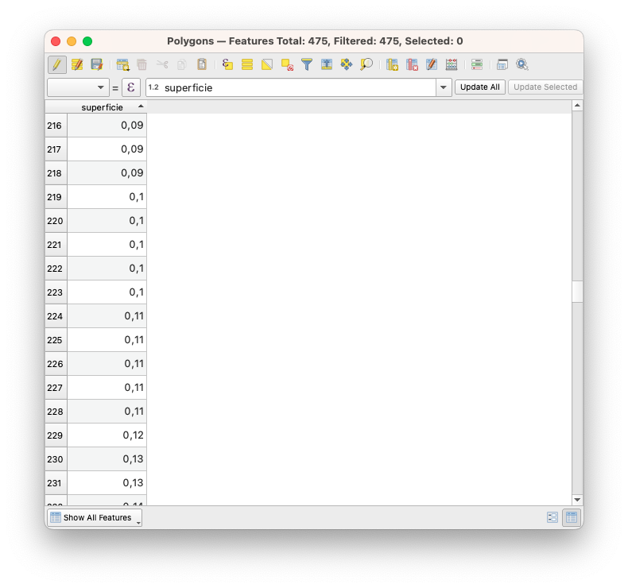

A questo punto possiamo selezionare e quindi cancellare tutti i poligoni toppo piccoli, ad es. con superficie minore di 0,1.
Clicchiamo sull'icona `Select Features Using an Expression`


Nella finstra delle epsressioni componiamo o incolliamo la seguente espressione, che permette si selezionare i poligoni con superficie minore di 0,1: `"superficie" < 0.1` e poi clicchiamo su `Select features` e quindi su Close:

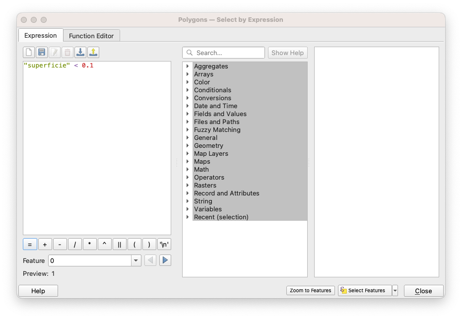

Dovremmo a questo punto avere selezionato tutti i poligoni non voluti e anche qualche blocco di minore dimensioni, che per l'esempio corrente non costituscono un problema statistico, in quanto si tratta di inzeppature e che si possono dunque cancellare.


Ulteriori problemi si possono risolvere in maniera manuale.

Possiamo finalmente cancellare i poligoni selezionati e salvare il layer:

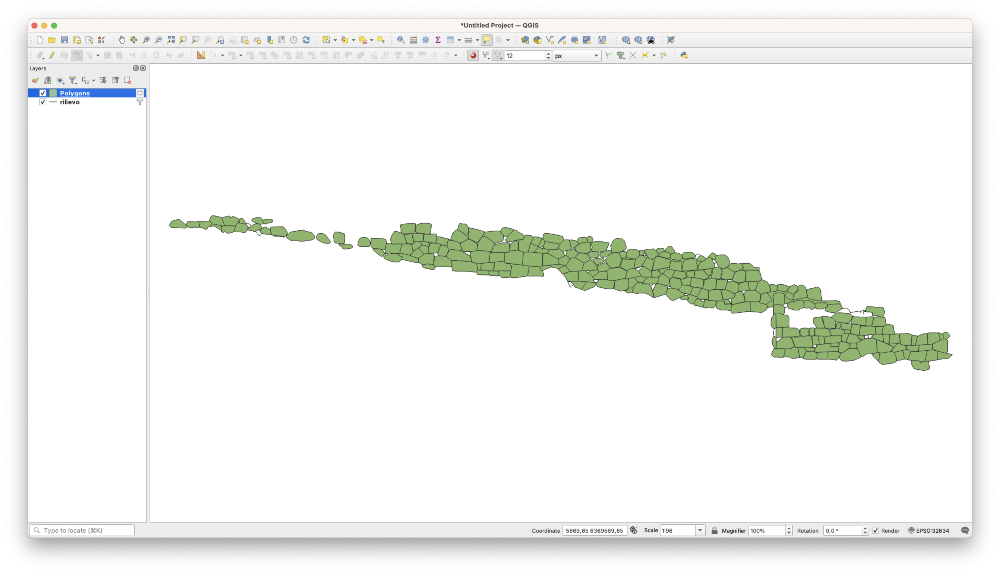

### 2. Creazione dei rettangoli degli ingombri minimi per le misurazioni

Per calcolare le dimensioni di ciascun blocco abbiamo a disposizione uno strumento specifico di QGIS che si chiama `Oriented minimum bounding box` e che si trova nel solito pannello `Processing`:


Ancora una volta le impostazioni predefinite vanno bene e creiamo un layer temporaneo:


L'algoritmo creera per ogni poligono del layer un rettango che lo iscrive perfettamente, definendo, come da nome, il rettangolo minimo di descrizione. Il risultato grafico è abbastanza confuso nel nostro esempio, perché i blocchi poligonali hanno orientamenti molto diversi tra loro. Più la muratura è regolare, più i rettangoli creati corrisponderanno con i poligoni sottostanti.

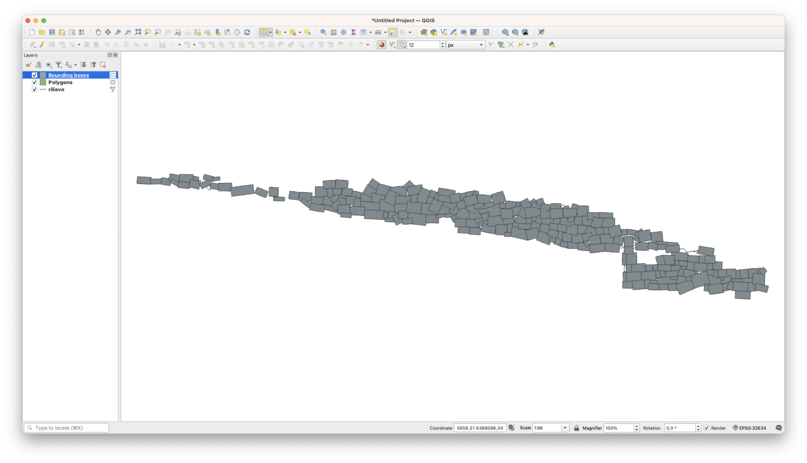

A noi interessa maggiormante la tabella degli attributi del nuovo layer creato:


Per ciasuno rettangolo creato, infatti, QGIS ha aggiunto i seguenti attributi:
- `width`: la larghezza
- `height`: la lunghezza
- `angle`: l'angolo di orientamento
- `area`: la superficie del rettangolo (sempre maggiore del valore riportato in `superficie`)
- `perimetro`: il perimetro del rettangolo

Tra questi a noi interessano maggiormente gli attributi `width` e `height`, che costituiscono le dimensioni maggiori dei nostri blocchi.

A questo punto abbiamo tutti i dati che servono alla nostra analisi e li possiamo estrarre e trattare con altri software per la statististica, ma possiamo anche continuare l'analisi in QGIS.

### 3. Trasferimento degli attributi ai poligoni del rilievo.
Dal momento che i rettangoli di ingombro non sono particolarmente significativi nelle loro geometrie, possiamo trasferire i loro attributi ai poligini di partenza. Per una maggiore precisione di questa operazione, passeremo attarverso la creazione di centriodi per ciasciun rettangolo. Selezioniamo l'algoritmo `Centroids` dal pannello di processing:


Utilizziamo le impostazioni predefinite e creiamo un layer temporaneo:


Se tutto è andato a buon fine dovremmo ottenere un layer di punti, rappresentante i centroidi di ogni rettangolo, accompagnato dagli attributi degli stessi:

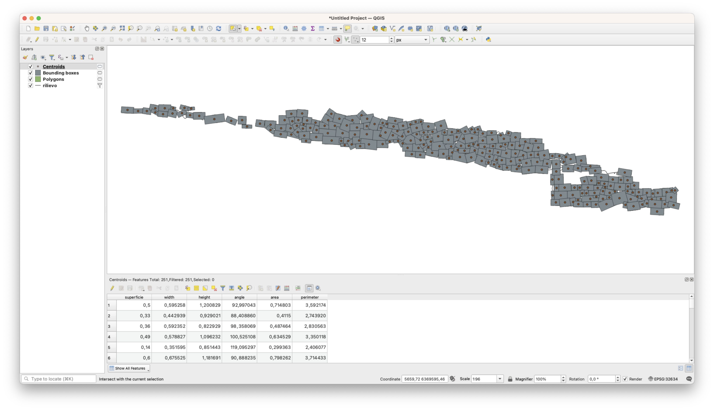

A questo punto possiamo usare un `join` spaziale per unire gli attributio di `Centroids` alle geometrie di `Polygons`.
Selezioniamo l'algoritmo `Join attributes by location` dal pannello `Processing`:


Nella finestra delle opzioni selezioniamo `Polygons` come `Base layer`, ovvero layer del quale usare le geometrie e `Centroids` come `Join layer` ovvereo layer dal quale prendere gli attributi.

Selezionare `contains` come predicato geometrico da usare per l'unione, lasciare vuolto `Fields to add` in maniera di importare tutti i campi (opzionalmente si possono anche selezionare i soli `width` e `height` che sono gli unici ad esserci utili).

Come `Join type` selezionare `Create separate feature for each matchin feature (one to many)`, anche se nel nostro caso non ci dovrebbereo essere casi di presenza di più centroidi per ogni poligono. Questa opzione creera due o più geometrie uguali in caso di più punti all'interno di ogni poligono. In quest'ultimo caso, i duplicati andranno risolti manualmente.

Infine, lasciamo l'opzione predefinita di creazione di un layer temporaneo dei risultati.

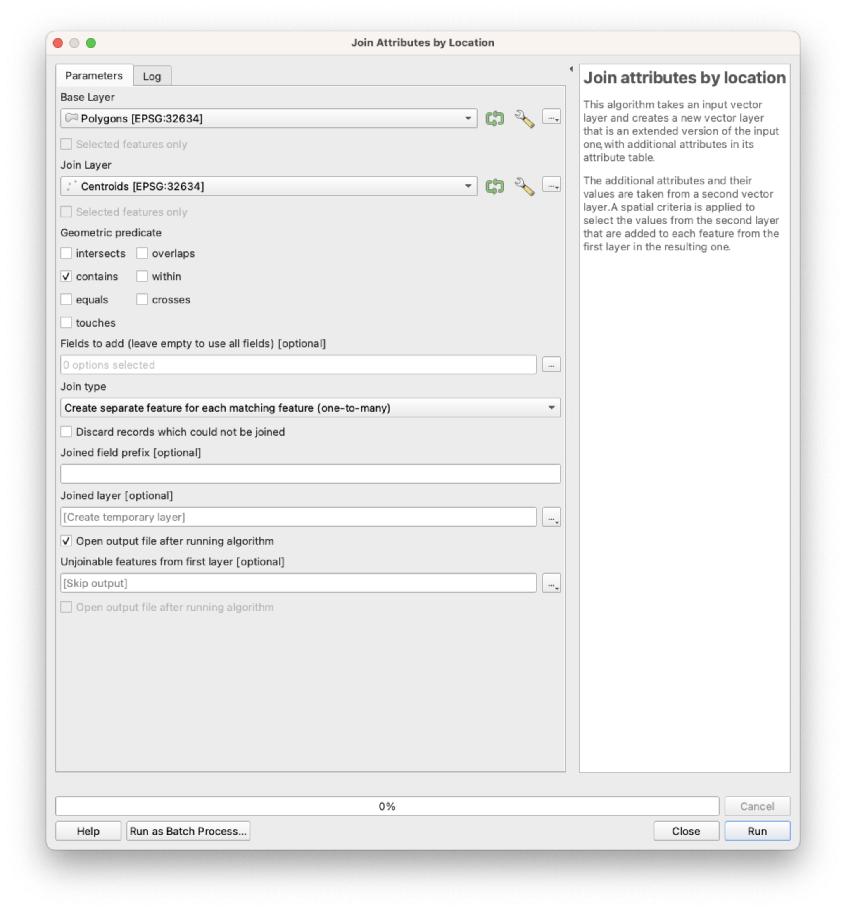

Se tutto è andata a buon fine dovremmo ottenere un risultato come nell'immagine seguente:


Come si vede nella tabella degli attributi il campo `superficie` è duplicato, ma questo campo non è molto importante per noi. Nei prossimi passaggi vedremo come pulire i dati


### Pulizia del layer definitivo e conversione delle unità

A questo punto possiamo salvare definitivamente il nostro layer e fare un po' di pulizia prima dell'analisi di visualizzazione.

Clicchiamo sull'icona del transistor sulla destra del nome del layer nel pannello dei layer per salvare i dati sul disco e scegliamo il formato geopackage con il nome rilievo-con-attributi.

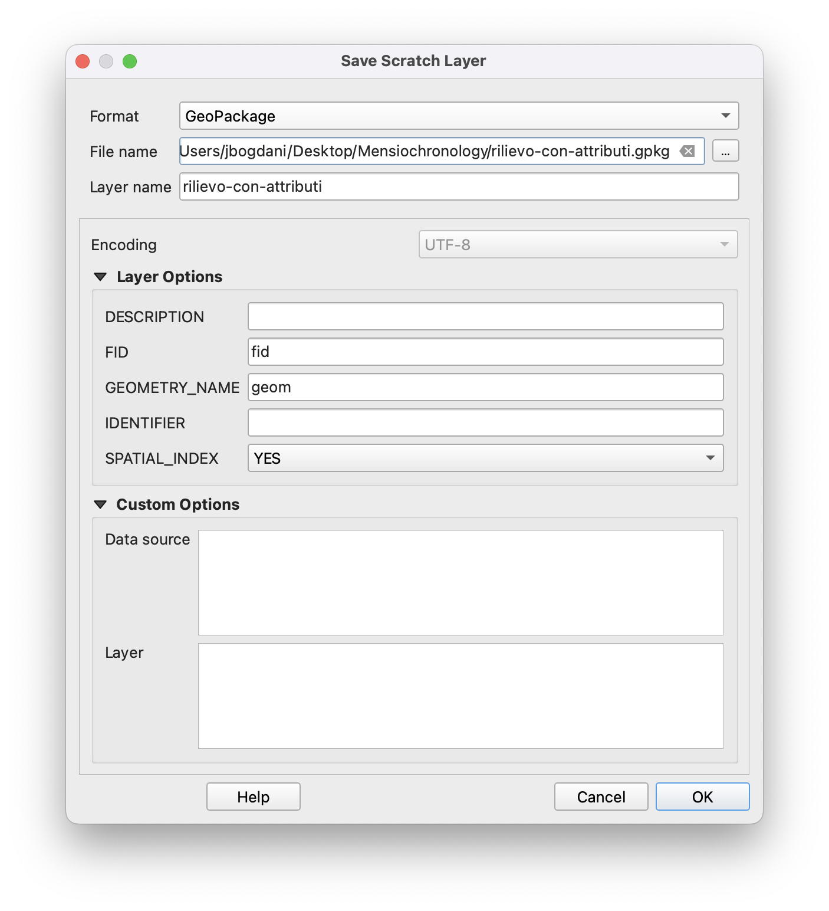

Click destro sul layer nel pannello del leyer e selezioniamo `Properties`. Nella finestra che si apre, andiamo su `Fields` e cancelliamo gli attributi che non ci servono, ovvero: `superficie`, `superficie_2`, `angle`, `area` e `perimeter`.

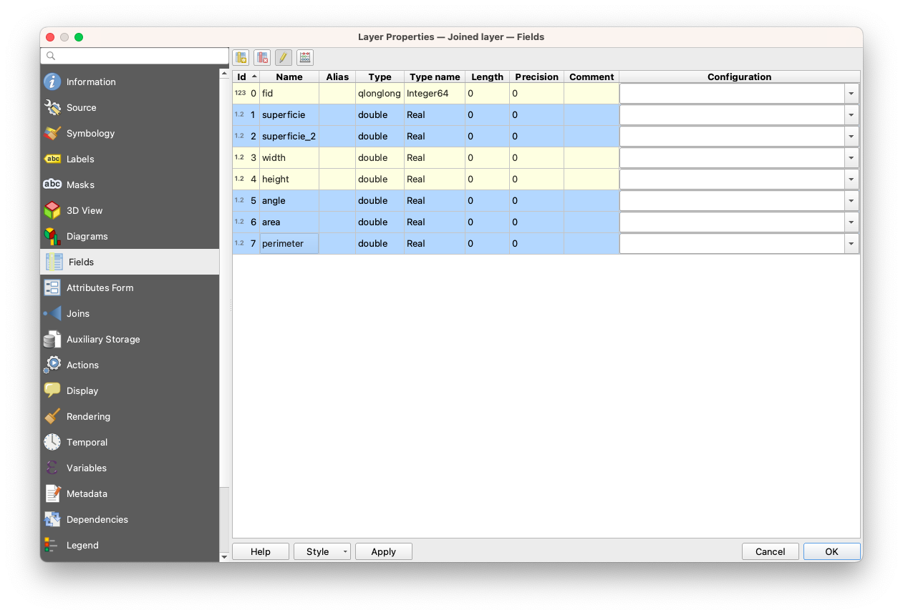

Dovremmo ottenere:


Siamo dunque pronti per convertire le nostre misure in metri in unità antiche e validare l'effettivo uso della misura. L'unità antica nel mondo greco (e romano) sono il piede e il cubito (1,5 piedi), ma la misura assoluta del piede cambia nello spazio e nel tempo. Per questo motivo, non useremo un valore fisso del piede, ma faremo varie prove, con misure assolute diverse.

Per questo motivo, andiamo a definire una variabile all'interno del layer che possiamo cambiare a piacimento e ottenere in maniera automatica calcoli aggiornati.

Nella stessa finestra delle proprietà, andiamo su `Variables` e definiamo una variabile che si chiama `piede` con il valore di 0.296 che è la misura canonica del cosiddetto piede attico:

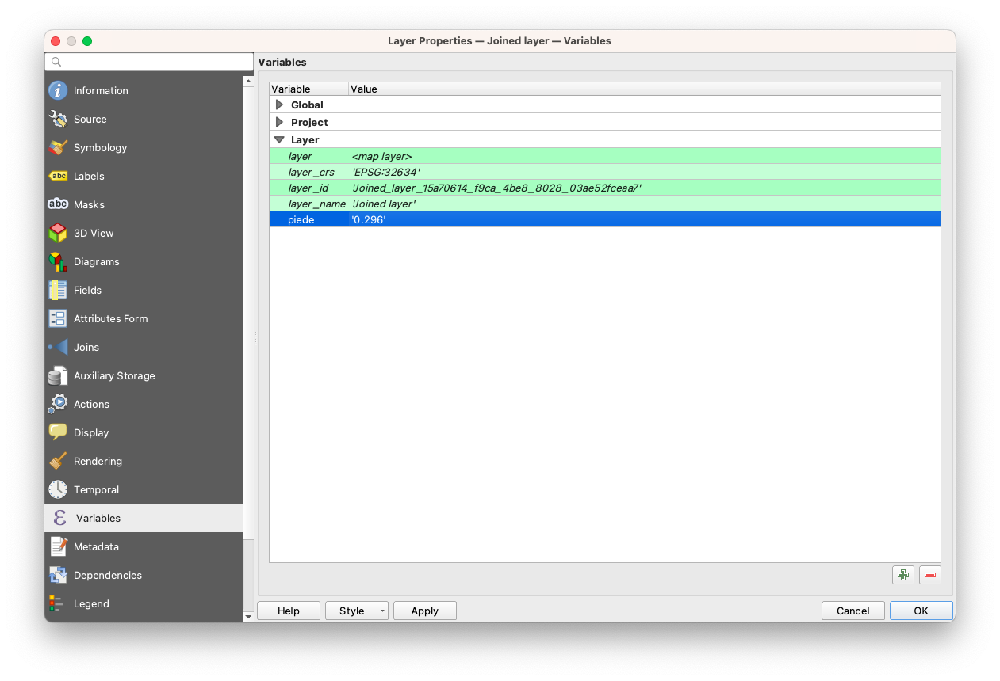

Clicchiamo su `Apply` in basso, torniamo in `Fields` e cominciamo a fare i nostri calcoli, aggiungendo quattro campi virtuali che rispettivamente conterranno:
- `w-piedi`: la conversione e arrotondamendo verso il basso della misura `width` in piedi
- `w-modulo`: il [modulo](https://it.wikipedia.org/wiki/Operazione_modulo) della conversione della misura `width` in piedi, ovvero la rimanenza della divisione. Questo dato misura il discostamento dall'unità ideale nella costruzione della struttura.
- `h-piedi`: la conversione e arrotondamendo verso il basso della misura `height` in piedi
- `h-modulo`: il [modulo](https://it.wikipedia.org/wiki/Operazione_modulo) della conversione della misura `height` in piedi, ovvero la rimanenza della divisione. Questo dato misura il discostamento dall'unità base nella costruzione della struttura.

Clicchiamo sull'icone del `Field Calculator` (Calcolatore dei Campi) e cominciamo a inserire i dati del primo campo, come da immagine:


L'espressione `floor("width"/@piede)` non pone particolari problemi: stiamo dividendo la misura `width` per la variabile `piede` e stiamo arrotondando il risultato all'intero più basso.

**Importante** risordarsi di:
- selezionare l'opzione `Create virtual field`, in maniere che i dati possano essere automaticamente aggiornati ogniqualvolta aggiorniamo la variabile `piede`
- selezionare come `Output field type`: `Whole numer`
- inserire come Output field length il valore `2`

Ripetiamo l'operazione per `w-modulo`: 


In questo caso selezioniamo `Decimal number (double)` per `Output field type`, dal momento che ci aspettiamo una rimanenza in centimetri, sempre minore della lunghezza del piede.

L'espressione `round("width" % @piede, 2)` arrotonda al secondo decimale (`round(n, 2)`) il risultato del calcolo del modulo (`%`) della misura `width` con la variabile `piede`.

Ripetiamo le due operazioni sopra anche per il campo `height` cambiando dove necessario `w` con `h` e `width` con `height`, a ottenere:

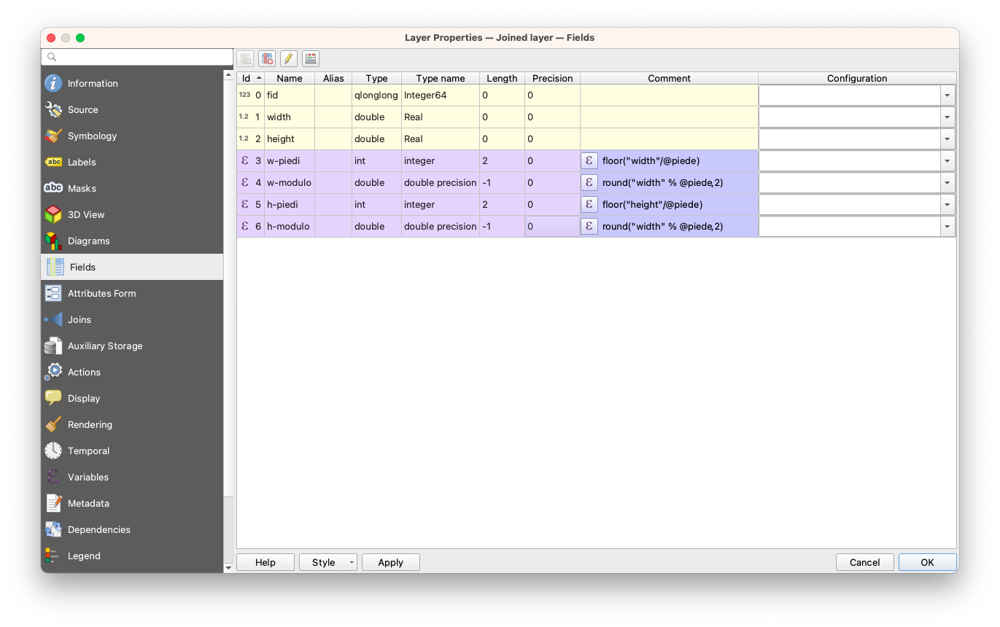


A questo punto abbiamo tutti i dati di cui abbiamo bisogno. Questi dati sono dinamici e dipendono dalla variabile `piede`. Se per esempio invece del piede attico vogliamo usare il piede olimpico di 30,8 cm non dobbiamo fare altro che aggioranare la variabile e i valori dei campi `w-piedi`, `w-modulo`, `h-piedi`, `h-modulo` verranno aggiornati in automatico:

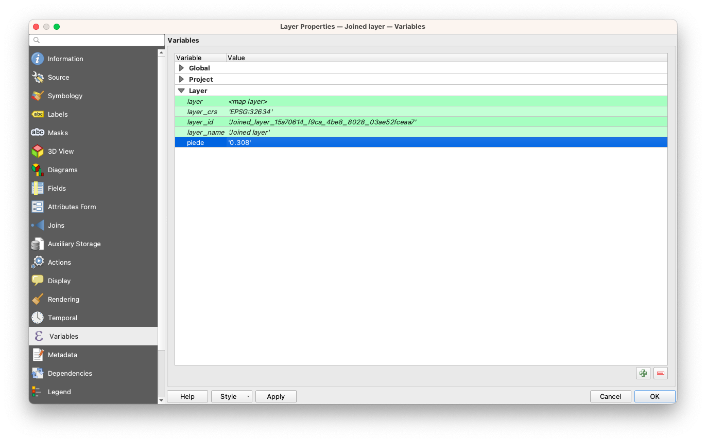


### 4. Visualizzare i dati

Possiamo, a questo punto, visualizzare con colori diversi quanto ciascun blocco si allontana dalla misure tonda (e multipi) del piede. Ciascuno può decidere dei criteri di visualizzazione diversi, ma per semplicità definiremo tre classi distinte:
- **Buona aderenza alla norma**: che raccoglie tutte le misure scarto (modulo) di `width` (ovvero `w-modulo`) da 0 (aderenza perfetta a piede) a +3 cm di tolleranza. In questa classe ci metteremo anche i valori alti di `w-modulo` (misure che si avvicinano al piede successivo), sempre con tolleranza di 3 cm;
- **Media aderenza alla norma**:  raccoglie le misure di `w-modulo` che si discostano da 3 a 6 cm dalla misura tonda (0 in basso o quasi la misura del piede in alto);
- **Cattiva aderenza alla norma**:  raccoglie le misure rimanenti, ovvero misure che di discostano per più di 6 cm dalla misure scelta come standard (la variabile `piede`).

Possiamo parametrizzare la misura di 3cm, come variabile, in maniera da poterla cambiare facilmente in maniera centralizzata.

Segue una guida per immagini commentate dei procedimeni:

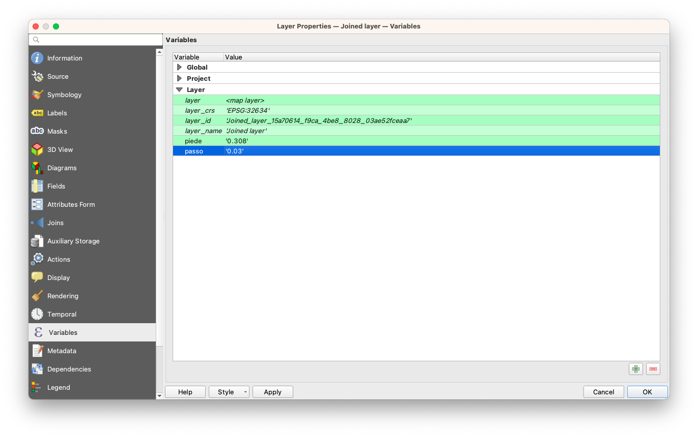

Configuro la variabile `passo` con il valore di 3cm.

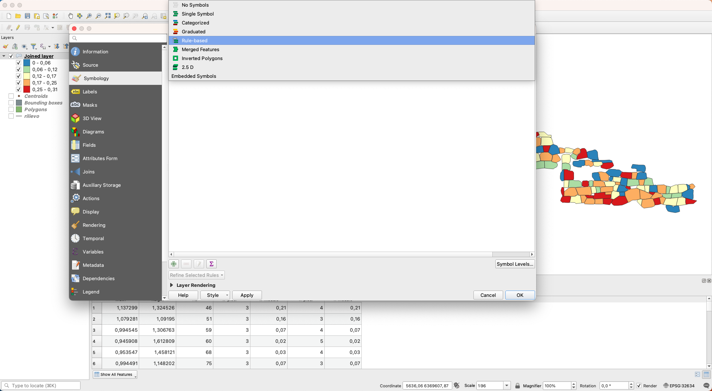

In `Symbology` selezioniamo il valore `Rule-based` e definiamo le nostre tre classi:

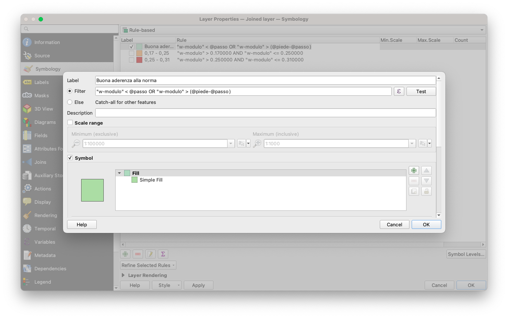

La classe **Buona aderenza alla norma** è definta dall'espressione: `"w-modulo" < @passo OR "w-modulo" > (@piede-@passo)`, ovvero tutti i valori di `w-modulo` minori della variabile `passo` (attualmente 3 cm) e tutti i valori di `w-modulo` maggiori del valore che risulta sottraendo la variabile `passo` (3 cm) alla variabile `piede` (29,6 cm), ovvero 26,6 cm.


La classe **Media aderenza alla norma** è definta dall'espressione:
```
(
  "w-modulo" > @passo
  AND
  "w-modulo" <= (@passo*2)
)
OR
(
  "w-modulo" < (@piede-@passo) 
  AND 
  "w-modulo" >= (@piede-(@passo*2))
)
```
Si tratta di tutti i valori di `w-modulo` maggiori della variabile `passo` (attualmente 3 cm) e minori/uguali del doppio di `passo` (attualmente 6 cm)  e tutti i valori di `w-modulo` maggiori/uguali della differenza tra `piede` e `passo` e maggiori/uguali della differenza tra `piede` e il doppio di `passo`, ovvero magiori/uguali di 29,6 - (3 * 2) = 23,6 cm.


Per la classe **Cattiva aderenza alla norma** possiamo usare per facilità la funzione `ELSE` che raggruppa tutti i valori attualmente non presenti nelle definizioni fin qui date.

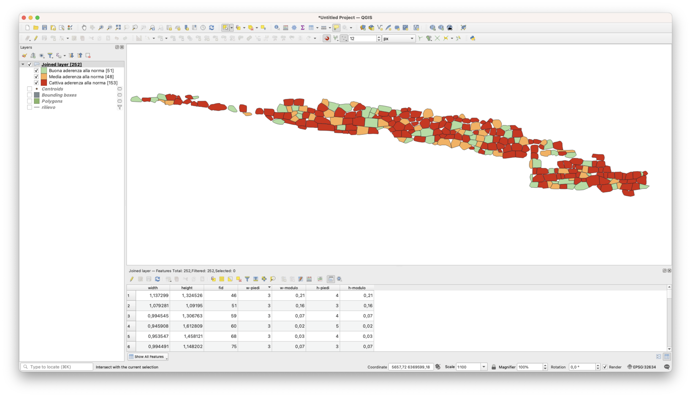

L'immagine sopra rappresenta il rislutato della nostra analisi, utilizzando il piede attico di 29,6 cm.


Cambiando il valore della variabile piede in 0.308, ovvero il piede olimpico, i risultati grafici si aggiorneranno di conseguenza:

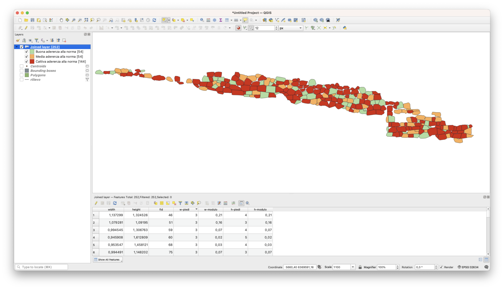

Naturalmente possiamo cambiare il valore del piede a coincidere con il cubito, oppure possiamo includere nella nostra simbologia nella classe **Buona aderenza alla norma** valori vicini a quello del cubito di riferimento (`@piede * 1.5`).


## Riferimenti
- Calcorare gli ingombri minimi di un layer di poligoni: [https://gis.stackexchange.com/a/265233](https://gis.stackexchange.com/a/265233)