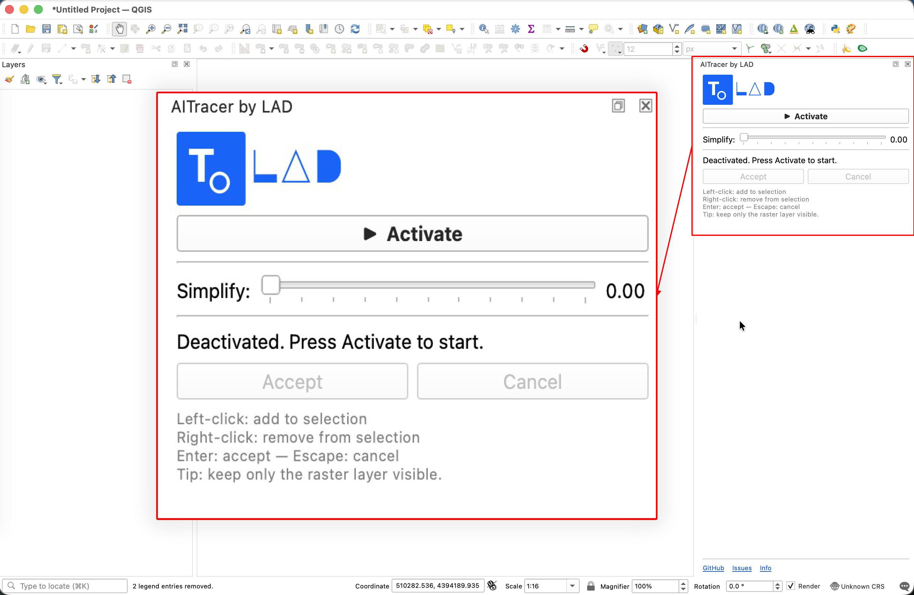
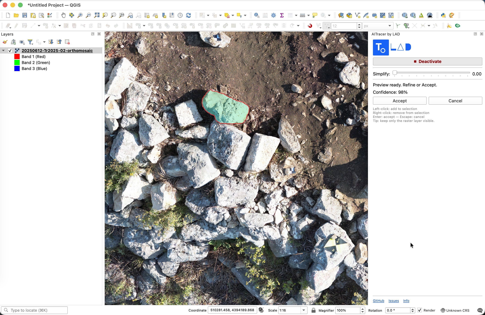
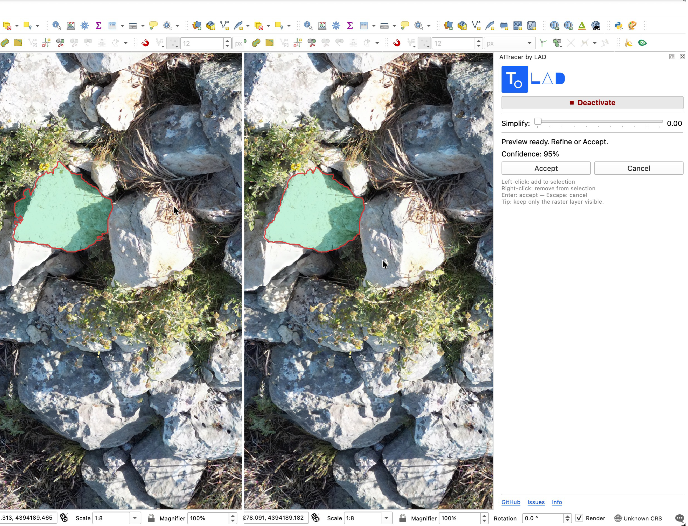
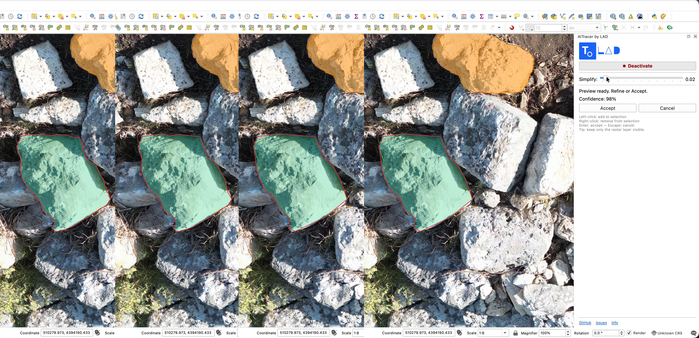
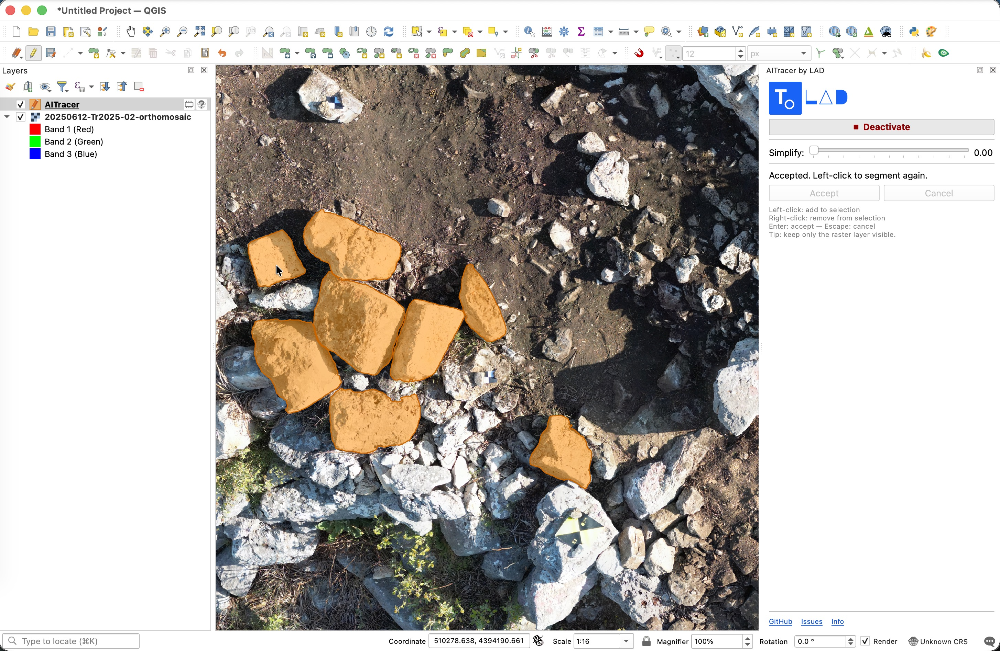
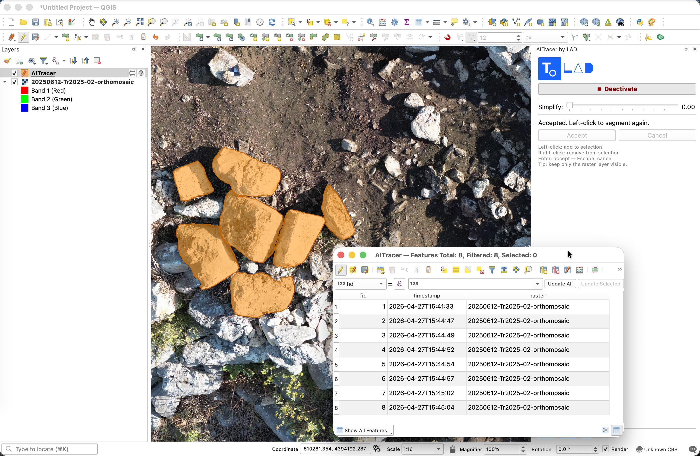
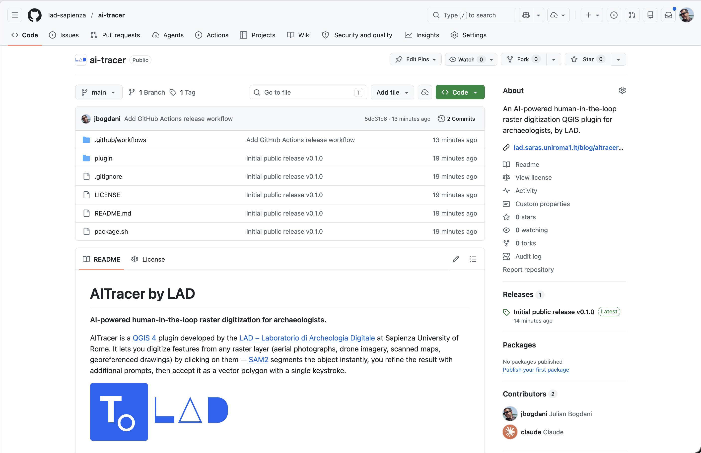

# AITracer by LAD: digitalizzazione di raster assistita dall’intelligenza artificiale in QGIS

Siamo lieti di presentare **AITracer by LAD**, un plugin per **QGIS 4** che porta l’intelligenza artificiale direttamente nel flusso di lavoro della digitalizzazione raster in archeologia. Sviluppato dal Laboratorio di Archeologia Digitale (LAD) della Sapienza, AITracer consente di vettorializzare qualsiasi feature visibile su un layer raster georiferito — fotografie aeree, ortofoto da drone, planimetrie scansionate, rilievi fotogrammetrici — con un semplice clic del mouse.

Il plugin è rilasciato con **licenza GNU GPL 3** ed è disponibile su GitHub:  
🔗 [https://github.com/lad-sapienza/ai-tracer](https://github.com/lad-sapienza/ai-tracer)

---

## Il problema: la digitalizzazione manuale è lenta

Chi lavora quotidianamente con dati raster in ambito archeologico conosce bene il tempo che richiede la vettorializzazione manuale: tracciare a mano i contorni di strutture murarie, buche di palo, tagli stratigrafici o aree di frammenti ceramici su un’ortofoto ad alta risoluzione è un’operazione precisa ma estremamente laboriosa. I risultati dipendono molto dall’esperienza e dalla concentrazione dell’operatore, e i tempi si moltiplicano rapidamente quando le geometrie da digitalizzare sono decine o centinaia.

AITracer non elimina il giudizio dell’archeologo — che rimane sempre l’interprete — ma accelera radicalmente la fase meccanica del tracciamento, lasciando all’operatore il controllo pieno sul risultato.

---

## Come funziona: SAM2 al servizio dell’archeologia

AITracer si basa su **SAM2** (*Segment Anything Model 2*), il modello di segmentazione di immagini sviluppato da Meta FAIR e rilasciato open source. SAM2 è in grado di identificare e delimitare oggetti all’interno di un’immagine a partire da semplici indicazioni puntuali — i cosiddetti *prompt* — senza essere stato addestrato specificamente su immagini archeologiche.

Il flusso di lavoro è il seguente:

1. Si carica un layer raster georiferito in QGIS e si imposta lo zoom sull’area di interesse.
2. Si attiva il plugin tramite il pannello **AITracer by LAD** e si clicca sull’oggetto da digitalizzare.
3. SAM2 analizza la porzione di canvas visibile e restituisce in pochi istanti il contorno della feature, visualizzato come poligono di anteprima verde direttamente sulla mappa.
4. Si accetta il poligono (tasto **Invio**) oppure si affina il risultato con clic aggiuntivi prima di accettarlo.

Il modello viene eseguito localmente, sul proprio computer, senza inviare alcun dato a servizi esterni.

---

## Il pannello di controllo

Una volta installato, il plugin aggiunge un pannello laterale alla finestra di QGIS.

*Il pannello AITracer by LAD con il pulsante di attivazione, il cursore di semplificazione, i pulsanti Accetta e Annulla e i collegamenti a GitHub e alla documentazione.*

---

## Prompt positivi e negativi

Il cuore del sistema è l’interazione iterativa con il modello tramite *prompt*:

- **Clic sinistro** — *prompt positivo*: indica al modello un punto che deve essere incluso nel poligono.
- **Clic destro** — *prompt negativo*: indica un punto da escludere, utile per affinare il contorno quando il modello include aree non desiderate.

Ogni clic aggiuntivo raffina la segmentazione senza ricalcolare l’intera analisi dell’immagine, grazie a una cache della codifica dell’immagine che il backend mantiene per tutta la durata della sessione.

*Dopo il primo clic sinistro sull’ortofoto, SAM2 restituisce quasi immediatamente un’anteprima del poligono (in verde) sovrapposta al layer raster.*

---

*Aggiunta di prompt negativi (clic destro) per escludere aree adiacenti erroneamente incluse nella segmentazione iniziale. Il poligono di anteprima si aggiorna in tempo reale.*

---

## Semplificazione geometrica in tempo reale

Le maschere prodotte da SAM2 possono contenere un numero molto elevato di vertici. AITracer integra un cursore di **semplificazione Douglas-Peucker** che permette di controllare la densità dei vertici del poligono finale prima di accettarlo, con passi di 0,01 unità mappa e un range da 0 (nessuna semplificazione) a 0,50.

*Confronto tra il poligono con semplificazione a 0 (sinistra, molti vertici) e con semplificazione a 0,15 (destra, contorno semplificato ma fedele alla forma originale).*

---

## Annulla l'ultimo punto

Se un clic è stato piazzato nel punto sbagliato, non è necessario annullare l'intera sessione. Il tasto Ctrl+Z rimuove l'ultimo punto inserito — positivo o negativo — e ricalcola immediatamente la segmentazione con i punti rimanenti. È possibile tornare indietro quanto si vuole, fino ad azzerare tutti i prompt.

---

## Accettare e salvare

Una volta soddisfatti del contorno, si preme **Invio** (o il pulsante *Accetta* nel pannello). Il poligono viene automaticamente aggiunto a un layer temporaneo in memoria chiamato **AITracer**, creato dal plugin con stile arancione semitrasparente. Il layer è completamente integrabile con il progetto QGIS e può essere esportato in qualsiasi formato vettoriale.

*La feature accettata appare nel layer AITracer (in arancione semitrasparente) sovrapposto al layer raster di partenza. È possibile continuare a digitalizzare nuove feature senza interruzioni.*

---

## Scegliere il layer di destinazione

Di default, i poligoni accettati vengono inseriti in un layer temporaneo in memoria chiamato AITracer. Dal pannello è però possibile scegliere qualsiasi layer vettoriale poligonale già presente nel progetto come destinazione, tramite un menù a tendina che si aggiorna automaticamente. Alla prima accettazione, il menù viene impostato sul layer AITracer appena creato, così i clic successivi vi confluiscono senza dover selezionare nulla.

---

Ogni feature accettata registra automaticamente tre attributi:

| Campo | Contenuto |
|---|---|
| `fid` | Identificativo progressivo automatico |
| `timestamp` | Data e ora di accettazione (ISO 8601) |
| `raster` | Nome del layer raster sorgente |

*La tabella degli attributi del layer AITracer con i campi fid, timestamp e raster compilati automaticamente per ciascuna feature accettata.*

---

## Prima installazione: tutto automatico

Il plugin gestisce autonomamente la propria infrastruttura computazionale. Al primo avvio:

1. crea un ambiente virtuale Python in `~/.aitracer/venv`;
2. installa le dipendenze necessarie (FastAPI, PyTorch, SAM2, OpenCV);
3. scarica i pesi del modello SAM2-tiny (~40 MB).

Un dialogo di avanzamento informa l’utente in ogni fase. Le attivazioni successive richiedono pochi secondi.

---

## Installazione del plugin

Il plugin si installa direttamente da QGIS tramite il gestore dei plugin:

1. Scarica il file `aitracer-vX.Y.Z.zip` dalla pagina delle [Release su GitHub](https://github.com/lad-sapienza/ai-tracer/releases).
2. In QGIS: **Plugin → Gestisci e installa plugin → Installa da ZIP**.
3. Seleziona il file scaricato e clicca **Installa plugin**.

È richiesto QGIS 4.0. Il runtime Python necessario viene scaricato e installato automaticamente dal plugin al primo avvio tramite python-build-standalone: non è richiesta alcuna installazione manuale di Python.

*La homepage del repository GitHub con il codice sorgente, la documentazione e le release scaricabili.*

---

## Una nota sul metodo: pair programming con l’IA

Questo plugin nasce anche come esperimento metodologico. L’intero processo di progettazione e sviluppo — dall’architettura del sistema alle singole funzioni Python, dalla gestione del backend alla UI del pannello — è stato condotto in stretta collaborazione con **[Claude](https://claude.ai)** di Anthropic, un assistente basato su modelli linguistici di grandi dimensioni.

Il risultato è un codice funzionante e testato sul campo, ma soprattutto una riflessione concreta su come l’IA generativa possa affiancare — non sostituire — il ricercatore nella produzione di strumenti digitali per la ricerca umanistica. Il controllo progettuale, le scelte interpretative e la verifica dei risultati sono rimasti sempre in capo al ricercatore umano.

---

## Provalo e contribuisci

AITracer è in sviluppo attivo. Ogni test sul campo, ogni segnalazione di problemi e ogni suggerimento è prezioso per migliorarlo.

- 📦 **Codice sorgente e release**: [github.com/lad-sapienza/ai-tracer](https://github.com/lad-sapienza/ai-tracer)
- 🐛 **Segnala un problema**: [github.com/lad-sapienza/ai-tracer/issues](https://github.com/lad-sapienza/ai-tracer/issues)
- 📖 **Approfondisci**: [lad.saras.uniroma1.it/blog/ai-tracer](https://lad.saras.uniroma1.it/blog/ai-tracer)
- ✉️ **Contatti**: [julian.bogdani@uniroma1.it](mailto:julian.bogdani@uniroma1.it)
